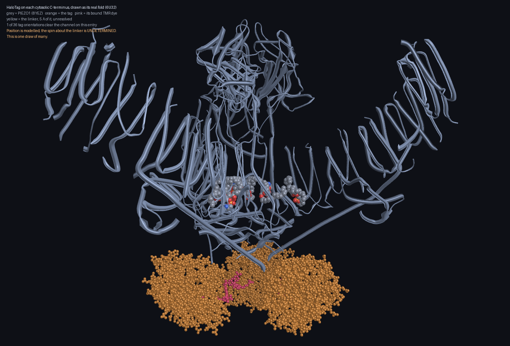
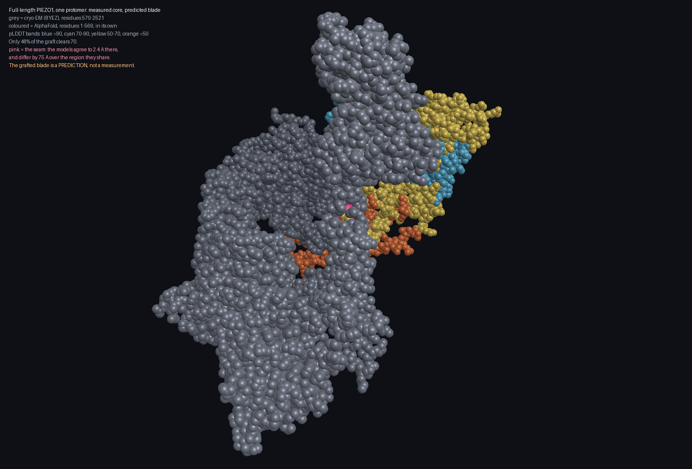
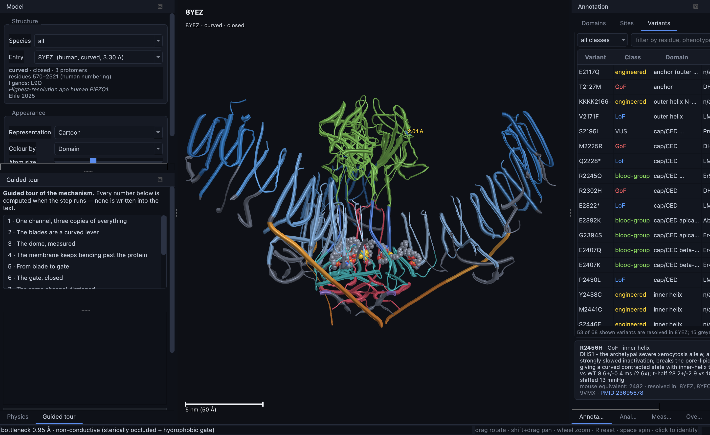
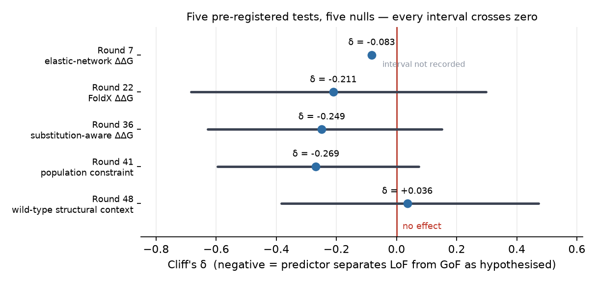

# PIEZO1 Dynamic Structural Simulator

An interactive 3-D model of the **PIEZO1** mechanosensitive ion channel, driven
by physics rather than animation. It is meant to work as a teaching instrument
and as a research one.


*Human PIEZO1 (PDB 8YEZ, 3.3 Å) seen down its three-fold axis. Blue: the nine
transmembrane helical units of each of the three blades. Green: the
extracellular cap. Red: the pore. Orange: the beam, the intracellular lever
that carries blade motion to the gate.*

---

> ### Read this first
> **[What this project established, and what it could not](docs/CONCLUSION.md)**
>
> The structural machinery works and reproduces published measurements. The
> variant-effect prediction the project was built for **does not work**, and
> the data that would settle it does not exist. One page, and every number on
> it is traceable to the code that produced it.

---

## Contents

- [What PIEZO1 is](#what-piezo1-is-and-why-its-shape-is-the-mechanism)
- [What the software does](#what-the-software-does)
- [Numbers it reproduces](#numbers-it-reproduces)
- [Installing](#installing)
- [Running it](#running-it)
- [Command line](#command-line)
- [Notebooks](#notebooks)
- [How it is built](#how-it-is-built)
- [Residue numbering](#a-warning-about-residue-numbering)
- [How the project checks itself](#how-the-project-checks-itself)
- [What this established, and what it did not](#what-this-established-and-what-it-did-not)
- [References](#references)

---

## What PIEZO1 is, and why its shape is the mechanism

PIEZO1 turns mechanical force into an electrical signal. It was identified in
2010 as the pore-forming subunit of a mechanically activated cation channel
(Coste et al. 2010). It is how the lining of your blood vessels senses flow,
how red blood cells set their volume, and how lymphatic valves form. Mutations
cause hereditary xerocytosis (Zarychanski et al. 2012; Andolfo et al. 2013) and
lymphatic dysplasia (Fotiou et al. 2015). One variant, E756del, reaches a gnomAD
allele frequency of 0.166–0.173 in African populations. It was proposed to
protect against severe malaria (Ma et al. 2018), but that is **contested**: a
later association study found an odds ratio of 0.91 (p = 0.19), and the
original mouse work tested a different allele, R2482H. The software records it
that way rather than repeating the headline — see
[`docs/SCIENCE.md`](docs/SCIENCE.md) for the detail.

**Its shape is not incidental to how it works — it is how it works.** The
channel is a trimer whose three curved blades bend the surrounding membrane
into a dome (Guo & MacKinnon 2017). Membrane tension flattens that dome, the
blades act as levers on the central pore, and the pore opens (Zhao et al. 2018;
Yang et al. 2022). The dome also distorts the membrane well beyond the protein
itself, and that "footprint" contributes much of the channel's sensitivity to
tension (Haselwandter & MacKinnon 2018).

You cannot see this in a sequence, and you cannot see it in a single static
picture. You have to watch it move — which is what this software is for.

---

## What the software does

### See the real structures

Twenty-one curated PDB entries, each catalogued with its gating state,
resolution, the residues actually resolved, its numbering species, bound
ligands, and the paper it came from. These span the first Piezo1 cryo-EM
structure (Ge et al. 2015; Saotome et al. 2018), curved and flattened states in
a lipid bilayer (Yang et al. 2022), structures in native vesicles (Vaisey &
MacKinnon 2026), and entries carrying the MDFIC auxiliary subunit (Zhou et al.
2023).

### Measure the membrane dome from coordinates

The software recovers the three-fold axis from the coordinates, fits the
mid-membrane surface, and reports the radius of curvature, the dome depth and
the excess membrane area. These are numbers you can compare directly with the
literature, and they do compare — see [below](#numbers-it-reproduces).


*The gating transition. Both panels are drawn at the same scale and
orientation. Left: curved mouse Piezo1 in a bilayer (7WLT). Right: the
flattened state (7WLU). The curvature in each was measured by this code from
the deposited coordinates.*

### Find the gating motion, and check it against symmetry

An elastic network model is built over the C-alpha trace, and its
low-frequency normal modes are extracted. Each mode is labelled by how it
behaves under the channel's three-fold rotation: **A** modes are symmetric,
**E** modes are not.

This label is not decoration. Membrane tension is isotropic, so it is itself
three-fold symmetric, and only an A mode can couple to it at first order. The
software tells you which modes are candidate gating coordinates and which ones
symmetry forbids — so a degenerate E mode cannot be mistaken for a mechanism.

### Follow the ion through the pore

Three separate questions, kept separate because a pore can be shut in more than
one way:

1. **Is it wide enough?** A radius profile along the conduction axis, found by
   maximising clearance in each slice.
2. **Would water stay in it?** A hydrophobic gate expels liquid water from a
   pore that is geometrically wide enough. The software applies the published
   heuristic of Rao et al. (2019), using their MD-derived free-energy grid.
   Radius alone predicts the conducting state at AUROC 0.59; radius combined
   with hydrophobicity reaches 0.91.
3. **What current would flow?** A one-dimensional drift-diffusion calculation
   over the measured pore, with access resistance, reporting every blocking
   mechanism rather than the first one it finds.

**View → Ion flux animation** then draws ions crossing at the rate the computed
current sets. A channel passes about 10⁷ ions per second, so any watchable
stream runs roughly a millionfold slow — and the display says so, rather than
implying you are watching real time. A structure the wetting model calls shut
draws no ions at all, and states why.

### Work with variants

68 curated variants, each with its wild-type residue verified against the
reference sequence, and each annotated with which deposited structures actually
resolve it. Where none do, the viewer says so instead of highlighting nothing.
A further 232 ClinVar pathogenic and likely-pathogenic variants are included
separately, with their direction inferred from the disease rather than measured.

### Model a HaloTag fusion

Imaging experiments often fuse HaloTag (Los et al. 2008) to PIEZO1's cytosolic
C-terminus, one per protomer. There is no experimental structure of that
fusion, so the software does not pretend there is one. It computes the
**accessible volume**: the region the tag centre can occupy without clashing,
given a flexible linker.



*The tag drawn as its real fold (PDB 6U32) at the modelled position. The tag's
own structure is experimental; where it sits is modelled; and the rotation
about the linker is not determined by anything, so the interface lets you turn
it and see that for yourself.*

You can draw the tag either as a sphere of its radius of gyration — which
claims exactly what the model determined and no more — or as the real fold.
Drawing the fold measured something the sphere could only assert: across 36
orientations the fold clears the channel in 27 of them on 7WLT, 7 on 8YFG, 1 on
8YEZ, and none at all on 11ZC. 11ZC is precisely the entry whose sphere
clearance falls below the tag's radius of gyration, so the two methods agree on
which structures can host a tag, while the sphere is optimistic about how much
room there is.

The software also predicts labelling kinetics and the calcium concentration a
dye on the tag would see when the channel opens.

### Build the full-length model

Cryo-EM resolves roughly residues 570–2521. The remaining 569 residues of the
distal blade have never been resolved by any experiment. The software grafts
the AlphaFold prediction onto the experimental core to give a full-length
model — and keeps the join visible rather than hiding it.



*The experimental core is grey. The grafted blade carries AlphaFold's own pLDDT
confidence colours, so you can see where the prediction is weak instead of
being handed one summary number. The seam is marked in pink.*

Every atom in the model records where it came from, so no analysis can average
across the join. Only 48% of the grafted region clears the conventional pLDDT
70 confidence threshold. The two models agree to 2.4 Å at the seam but differ
by 75 Å over the region they share — which is the number a good local fit
would otherwise hide.

---

## Numbers it reproduces

These are recomputed from the coordinates on every test run and checked against
the published values. If one drifts, the suite fails.

| Quantity | This software | Published | Source |
|---|---|---|---|
| Dome radius of curvature (7WLT, curved) | **9.7 nm** | 10.2 nm | Haselwandter & MacKinnon 2018 |
| Half-activation tension T₅₀ | **2.71 mN/m** | 2.7 ± 0.1 mN/m | Lewis & Grandl 2015 |
| Footprint decay length (round trip) | **14.00 nm** | 14 nm | Haselwandter & MacKinnon 2018 |
| Pore bottleneck, closed (8YEZ) | **0.95 Å** | closed | Rao et al. 2019 criterion |
| Pore bottleneck, open-like (11ZC) | **3.3 Å** | conducting | Vaisey & MacKinnon 2026 |
| Single-channel conductance | 41 pS | 25–30 pS | Coste et al. 2010; Shi et al. 2020 |

The conductance is the one that does **not** agree, and it is reported that way
rather than tuned. Two of its inputs — the in-pore diffusivity and the
effective ion radius — have never been measured, and across their plausible
ranges the answer spans 16–94 pS. Agreement would have been fitting, not
prediction.

### The gating motion

An elastic network model built from the **closed structure alone** reproduces
the experimentally observed transition to the flattened state. Comparing curved
mouse Piezo1 (7WLT) with the flattened state (7WLU) over the 1,274 residues
resolved in all six protomers, a 19.7 Å trimer RMSD:

| | |
|---|---|
| Best single-mode overlap with the observed change | **0.705** (mode 3, symmetry A) |
| Cumulative overlap over 40 modes | **0.964** |
| Best **E**-mode overlap | **0.0011** |
| Share of total overlap carried by A modes | **100.00%** |

Every symmetry-forbidden mode scores essentially zero. The model does not
merely fit the transition; it finds it through the channel that theory permits.

The three-fold axis is recovered exactly: 120.00°, 0.00 Å RMSD.

### Membrane mechanics

The linear Helfrich theory usually applied to PIEZO1 assumes small slopes.
PIEZO1's dome meets the membrane at about 63°, which is not small. Solving the
full nonlinear axisymmetric problem instead shows the linear approximation
overestimates the footprint energy by **3.65×** and the excess area by 3.48×.
Feeding the corrected area change back into the gating energetics moves the
predicted T₅₀ *toward* the measured value, though it does not close the gap
between the structural and functional estimates.

---

## Installing

```bash
git clone <this repository>
cd piezo1_simulation

bash scripts/create_env.sh      # creates the conda environment, ~5 min
conda activate piezo1

python -m piezo1.io.fetch       # downloads ~90 MB of structures and sequences

python -m piezo1                # run
```

You need a GPU supporting **OpenGL 4.1 core**. Verified on macOS with Apple
Silicon; Linux and Windows should work but are not routinely tested.

Nothing downloaded is stored in the repository. `python -m piezo1.io.fetch`
regenerates all of it.

---

## Running it


```bash
python -m piezo1                            # or --structure 8YEZ --geometry 1280x800
```

### Controls

| Input | What it does |
|---|---|
| Drag | Rotate |
| Shift-drag, or middle-drag | Pan |
| Right-drag, or wheel | Zoom |
| **Left-click an atom** | Identify it and mark it in gold. Rotating never selects, however the drag ends. |
| **Right-click** | Context menu for whatever is under the cursor |
| `R` / `O` / `Space` | Reset camera / switch projection / spin |
| `+` `-` | Grow or shrink the drawn atoms |
| `F1` / `F2` | Feature guide / guided tour |
| `Ctrl+P` | Every registered parameter, with its source |

The right-click menu offers to select the residue you clicked, the same residue
in all three protomers, or the whole chain; to add the atom to a measurement;
to centre the view on it; and to copy its label. It also carries the
representation, colouring and view settings. It names any variant reported at
that residue.

### Measuring

Clicking normally identifies a residue, so measuring is a mode you enter
deliberately. In the **Measure** panel, choose distance, angle or dihedral,
press **Start picking**, then click atoms in the 3-D view. Each pick appears in
the table immediately and is marked in blue on the model. The regression case
is the C2411–C2415 disulfide, which must come out at 2.04 Å.

### Panels

Every panel is a dock. Drag it to any edge, tear it off into its own window, or
close it and bring it back from **View → Panels**. `Ctrl+R` restores the
shipped arrangement.

- **Model** — choose a structure and how it is drawn.
- **Annotation** — domains, functional sites and variants. Selecting one
  highlights it and explains it, with the PMID.
- **Physics** — measure the dome, compute and animate normal modes, or colour
  the structure by how far each residue moves in a chosen mode.
- **Analysis** — the pore profile with hydrophobicity drawn against it, pocket
  detection, and per-residue conservation or mechanical coupling as colour
  maps. Click the pore plot to select the residues lining it at that height.
- **Measure** — click-to-measure distances, angles and dihedrals, with CSV
  export.



Other windows: **Overlay** superposes a second structure and reports where the
two differ, searching protomer correspondence rather than trusting chain labels
(7WLU on 7WLT gives 12.3 Å matched, against 90.7 Å by label). **Sequences**
(`Ctrl+Shift+S`) shows protein and coding sequences, with selection linked to
the 3-D view. **Presentation mode** (`F11`) fills the screen, and `Ctrl+D`
chooses what the overlay shows, so a screenshot carries its own scale bar and
its own numbers.

Sessions save and reload what you were looking at — never results. Analysis
reports export to Markdown or JSON with the provenance of every number attached.

### Domain colour key


---

## Command line

Everything the GUI computes is scriptable, and every result carries its
provenance.

```bash
python -m piezo1.cli list                        # what is available
python -m piezo1.cli dome 8YEZ --json            # membrane dome geometry
python -m piezo1.cli pore 11ZC                   # pore profile and bottleneck
python -m piezo1.cli modes 8YEZ --n-modes 30     # modes with symmetry labels
python -m piezo1.cli permeation 11ZC             # ion current through the pore
python -m piezo1.cli hybrid 8YEZ                 # full-length model
python -m piezo1.cli fusion 8YEZ                 # HaloTag fusion geometry
python -m piezo1.cli report 8YEZ -o report.md    # everything, with provenance
python -m piezo1.cli batch --analyses dome pore  # across every structure
```

The batch run reproduces the gating series in one command: curved entries at
radius of curvature 9.3–12.5 nm, the 8IXO intermediate at 16.5 nm, and flat
11ZC at 21.6 nm — the only one the wetting model calls conductive.

See [`docs/NOTEBOOK.md`](docs/NOTEBOOK.md) for the Python API.

### Notebooks

Four worked examples are in [`notebooks/`](notebooks/), meant to be read in
order:

| | |
|---|---|
| `01_first_look` | What is in a deposited structure, how to frame it, and measuring the dome |
| `02_gating_motion` | The elastic network model and the symmetry rule that says which motions can couple to tension |
| `03_pore_to_current` | Is the pore open, would water stay in it, and what current would flow |
| `04_variants_and_the_null` | The variant workflow, and the result that did not work |

```bash
pip install -e ".[notebooks]"
jupyter lab notebooks/
```

They ship **without stored outputs** and `assert` the numbers they quote
instead, so running one checks the science rather than only the syntax. A
committed output is a number nobody recomputes, and it goes stale silently.

### Animations

```bash
python scripts/make_animations.py --list    # what is available
python scripts/make_animations.py           # render all as GIF
```


Seven animations ship. Every frame is captioned with what it shows, and states
plainly that a morph is an interpolation between two experimental endpoints
rather than a simulated trajectory.

---

## How it is built

```
io ──▶ core ──▶ structure ──▶ physics ──▶ analysis
                                  │
                   render ◀───────┴───────▶ ui
```

Nothing at or below `physics` imports from the renderer or the GUI, so the
whole scientific engine can be driven from a notebook or a test with no display
attached.

**Rendering** uses ray-cast impostors. A sphere is drawn as a four-vertex
screen-facing quad whose fragment shader solves the ray–sphere intersection and
writes the depth directly. This is the technique PyMOL, VMD and ChimeraX use,
and it keeps a 120,000-atom model interactive: a full PIEZO1 trimer renders in
14–20 ms.

**Secondary structure** is assigned from C-alpha geometry alone, because large
parts of these cryo-EM models are backbone-only, where a hydrogen-bond method
such as DSSP cannot run at all.

**Normal modes** come from a sparse Hessian solved by shift-invert Lanczos: 40
modes over 12,177 degrees of freedom in about three seconds.

See [`INTERFACE.md`](INTERFACE.md) for the module-by-module map and
[`docs/SCIENCE.md`](docs/SCIENCE.md) for the scientific basis and its sources.

---

## A warning about residue numbering

Most PIEZO1 *mechanism* papers number residues by **mouse** Piezo1 (2,547
residues). Most *disease* papers number by **human** PIEZO1 (2,521 residues).

**The offset between them is not constant.** It varies from 0 to +26 across the
chain in twelve distinct blocks, and it passes through zero twice. Mouse A1718
and human A1718 are the same residue; mouse E2496 is human E2470. Getting this
wrong silently highlights the wrong helix.

So this project never hard-codes a conversion. Every conversion goes through a
real global alignment, every residue number in every data file states which
system it is in, and the build scripts verify each declared residue against the
actual reference sequence and refuse to ship a mismatch.

---

## How the project checks itself

These are deliberate, and as a research tool they are the point.

**Every number is a registered parameter.** All 104 numbers the calculations
depend on live in one registry, each with a unit, bounds, a kind and a
citation. You can inspect and override any of them from **Options →
Parameters** (`Ctrl+P`). A constant hidden in a function default cannot be
listed, shown to a user, or traced to a paper — and several numbers this
project has had to correct were hidden in exactly that way. An automated audit
fails the build if a new one appears.

**Provenance travels with every number.** Each domain boundary records whether
it came from UniProt, from a stated derivation rule, or from a paper, with a
confidence label. Results carry the structure and the parameter set that
produced them, recorded at the time they were computed.

**Coverage is reported, not hidden.** 14 of the 68 curated variants — including
the malaria-associated E756del allele — are not resolved in *any* human PIEZO1
structure. The viewer says so.

**Unverifiable annotations are left out.** Two domain names common in secondary
sources ("clasp", "latch") were dropped because neither survived checking
against the primary literature. Inventing boundaries would colour residues with
false confidence.

**A checking instrument is calibrated before it is believed.** The most
expensive errors in this project all had the same shape: a second method,
written to check the first, was itself wrong — and returned a plausible number
rather than an error, so the disagreement looked like a finding. Every checking
routine is now registered with the known-answer case that calibrates it, and a
test fails if one is added without one.

### Reproducing everything

```bash
make reproduce      # fetch, rebuild, test, re-run both validations, verify
make coldclone      # run the whole project from a genuinely empty clone
make verify         # check every documented number against the code
```

`make coldclone` exists because a cache hides a whole class of defect: it found
three on its first run, including a download endpoint that had been broken for
months. On an empty clone a data-dependent test must *skip*, never fail.

---

## What this established, and what it did not

The structural machinery works, and the numbers are in
[`docs/CONCLUSION.md`](docs/CONCLUSION.md) alongside the code that regenerates
each one. The dome curvature, the half-activation tension, the gating mode and
the closed-pore dewetting all reproduce or predict something checkable.

**The variant prediction it was built for does not work.** Five pre-registered
tests, five different predictor families — elastic-network energy, FoldX
stability, a substitution-aware version of the first, population constraint,
and the wild-type structural context of the position — and five nulls. Every
effect interval crosses zero.



**And the data that would decide it does not exist.** This is what makes the
result more than a list of failures, and it was measured rather than assumed.
Across positions, the effect the best predictor produces would need **134**
directional variants; the most this project could ever assemble is **59**.
Within positions — comparing two variants at the same residue, which removes
the between-position variance that consumed 99.8% of the first predictor's
signal — the curated and ClinVar sets together contain exactly **one** usable
site.

So a sixth test on this variant set should not be run, whatever predictor goes
into it. What is reusable is not the predictor but the apparatus that showed it
could not be validated: pre-registration with a decision rule fixed in advance,
a negative control in every test, feasibility costed before another attempt,
and every checking instrument calibrated against a known answer before its
disagreement is believed. That apparatus is written up for reuse in
[`docs/METHODS_NOTE.md`](docs/METHODS_NOTE.md).

---

## Data sources

Structures from the [RCSB PDB](https://www.rcsb.org/); sequences and features
from [UniProt](https://www.uniprot.org/) (Q92508 human, E2JF22 mouse);
predicted structure from [AlphaFold DB](https://alphafold.ebi.ac.uk/);
compounds from [PubChem](https://pubchem.ncbi.nlm.nih.gov/); population
constraint from [gnomAD](https://gnomad.broadinstitute.org/); variant effect
predictions from [ProtVar](https://www.ebi.ac.uk/ProtVar/) (EMBL-EBI, CC BY
4.0); the pore hydration grid from
[CHAP](https://www.channotation.org/) (MIT licence).

None of it is committed to this repository.

---

## Licence and citation

Research and educational use. **This is not a clinical tool and nothing in it
is validated for diagnosis.**

If you use this in published work, please cite the underlying structural and
functional papers below rather than this software. They did the hard part.

---

## References

The full bibliography — 73 references, each verified against Europe PMC
metadata, with a note on what it is used for — is in
[`docs/REFERENCES.md`](docs/REFERENCES.md). The papers behind the numbers
quoted above are:

**Discovery and physiology**

1. Coste B, Mathur J, Schmidt M, Earley TJ, Ranade S, Petrus MJ, Dubin AE,
   Patapoutian A. Piezo1 and Piezo2 are essential components of distinct
   mechanically activated cation channels. *Science* 2010;330:55–60.
   [doi:10.1126/science.1193270](https://doi.org/10.1126/science.1193270)
2. Zarychanski R, Schulz VP, Houston BL, Maksimova Y, Houston DS, Smith B,
   Rinehart J, Gallagher PG. Mutations in the mechanotransduction protein
   PIEZO1 are associated with hereditary xerocytosis. *Blood*
   2012;120:1908–1915.
   [doi:10.1182/blood-2012-04-422253](https://doi.org/10.1182/blood-2012-04-422253)
3. Andolfo I, Alper SL, De Franceschi L, *et al.* Multiple clinical forms of
   dehydrated hereditary stomatocytosis arise from mutations in PIEZO1. *Blood*
   2013;121:3925–3935.
   [doi:10.1182/blood-2013-02-482489](https://doi.org/10.1182/blood-2013-02-482489)
4. Fotiou E, Martin-Almedina S, Simpson MA, *et al.* Novel mutations in PIEZO1
   cause an autosomal recessive generalized lymphatic dysplasia with non-immune
   hydrops fetalis. *Nature Communications* 2015;6:8085.
   [doi:10.1038/ncomms9085](https://doi.org/10.1038/ncomms9085)
5. Ma S, Cahalan S, LaMonte G, *et al.* Common PIEZO1 allele in African
   populations causes RBC dehydration and attenuates *Plasmodium* infection.
   *Cell* 2018;173:443–455.e12.
   [doi:10.1016/j.cell.2018.02.047](https://doi.org/10.1016/j.cell.2018.02.047)

**Structure**

6. Ge J, Li W, Zhao Q, *et al.* Architecture of the mammalian mechanosensitive
   Piezo1 channel. *Nature* 2015;527:64–69.
   [doi:10.1038/nature15247](https://doi.org/10.1038/nature15247)
7. Guo YR, MacKinnon R. Structure-based membrane dome mechanism for Piezo
   mechanosensitivity. *eLife* 2017;6:e33660.
   [doi:10.7554/eLife.33660](https://doi.org/10.7554/elife.33660)
8. Saotome K, Murthy SE, Kefauver JM, Whitwam T, Patapoutian A, Ward AB.
   Structure of the mechanically activated ion channel Piezo1. *Nature*
   2018;554:481–486.
   [doi:10.1038/nature25453](https://doi.org/10.1038/nature25453)
9. Zhao Q, Zhou H, Chi S, *et al.* Structure and mechanogating mechanism of the
   Piezo1 channel. *Nature* 2018;554:487–492.
   [doi:10.1038/nature25743](https://doi.org/10.1038/nature25743)
10. Geng J, Liu W, Zhou H, *et al.* A plug-and-latch mechanism for gating the
    mechanosensitive Piezo channel. *Neuron* 2020;106:438–451.e6.
    [doi:10.1016/j.neuron.2020.02.010](https://doi.org/10.1016/j.neuron.2020.02.010)
11. Yang X, Lin C, Chen X, Li S, Li X, Xiao B. Structure deformation and
    curvature sensing of PIEZO1 in lipid membranes. *Nature* 2022;604:377–383.
    [doi:10.1038/s41586-022-04574-8](https://doi.org/10.1038/s41586-022-04574-8)
12. Zhou Z, Ma X, Lin Y, *et al.* MyoD-family inhibitor proteins act as
    auxiliary subunits of Piezo channels. *Science* 2023;381:799–804.
    [doi:10.1126/science.adh8190](https://doi.org/10.1126/science.adh8190)
13. Vaisey G, MacKinnon R. Lipid composition and mechanical force underlie
    multi-modal regulation of Piezo1 gating. *Science Advances* 2026;12:eaed7115.
    [doi:10.1126/sciadv.aed7115](https://doi.org/10.1126/sciadv.aed7115)

**Membrane mechanics and energetics**

14. Haselwandter CA, MacKinnon R. Piezo's membrane footprint and its
    contribution to mechanosensitivity. *eLife* 2018;7:e41968.
    [doi:10.7554/eLife.41968](https://doi.org/10.7554/elife.41968)
15. Dixit S, Noé F, Weikl TR. Conformational changes, excess area, and
    elasticity of the Piezo protein–membrane nanodome from coarse-grained and
    atomistic simulations. *eLife* 2025;14:RP105138.
    [doi:10.7554/eLife.105138](https://doi.org/10.7554/elife.105138)

**Gating, kinetics and pharmacology**

16. Bae C, Sachs F, Gottlieb PA. The mechanosensitive ion channel Piezo1 is
    inhibited by the peptide GsMTx4. *Biochemistry* 2011;50:6295–6300.
    [doi:10.1021/bi200770q](https://doi.org/10.1021/bi200770q)
17. Syeda R, Xu J, Dubin AE, *et al.* Chemical activation of the
    mechanotransduction channel Piezo1. *eLife* 2015;4:e07369.
    [doi:10.7554/eLife.07369](https://doi.org/10.7554/elife.07369)
18. Lewis AH, Grandl J. Mechanical sensitivity of Piezo1 ion channels can be
    tuned by cellular membrane tension. *eLife* 2015;4:e12088.
    [doi:10.7554/eLife.12088](https://doi.org/10.7554/elife.12088)
19. Shi J, Hyman AJ, De Vecchis D, *et al.* Sphingomyelinase disables
    inactivation in endogenous PIEZO1 channels. *Cell Reports* 2020;33:108225.
    [doi:10.1016/j.celrep.2020.108225](https://doi.org/10.1016/j.celrep.2020.108225)
20. Young MN, Sindoni MJ, Lewis AH, Zauscher S, Grandl J. The energetics of
    rapid cellular mechanotransduction. *PNAS* 2023;120:e2215747120.
    [doi:10.1073/pnas.2215747120](https://doi.org/10.1073/pnas.2215747120)

**Methods this project applies**

21. Rao S, Klesse G, Stansfeld PJ, Tucker SJ, Sansom MSP. A heuristic derived
    from analysis of the ion channel structural proteome permits the rapid
    identification of hydrophobic gates. *PNAS* 2019;116:13989–13995.
    [doi:10.1073/pnas.1902702116](https://doi.org/10.1073/pnas.1902702116)
22. Los GV, Encell LP, McDougall MG, *et al.* HaloTag: a novel protein labeling
    technology for cell imaging and protein analysis. *ACS Chemical Biology*
    2008;3:373–382.
    [doi:10.1021/cb800025k](https://doi.org/10.1021/cb800025k)
