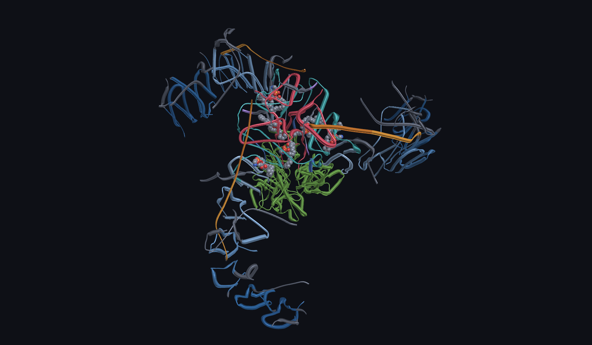
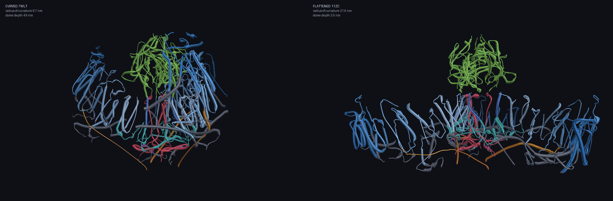
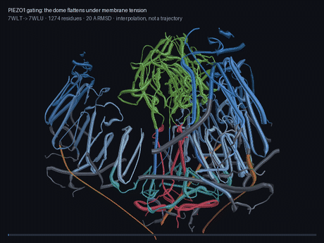
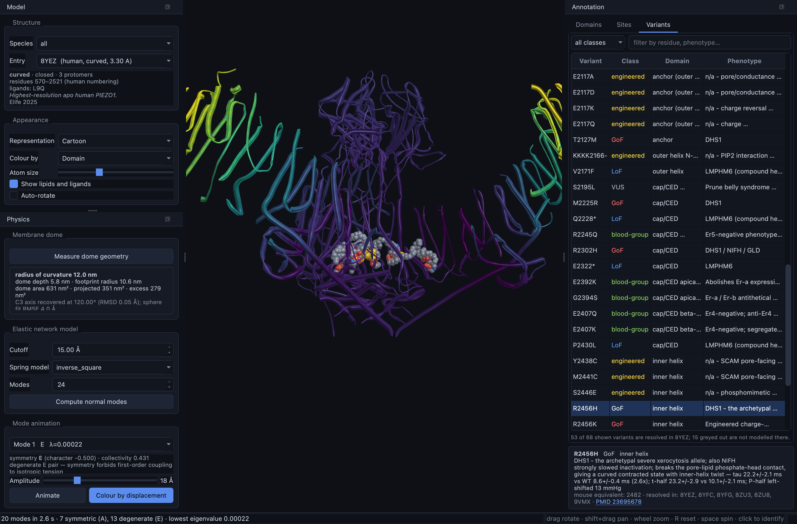
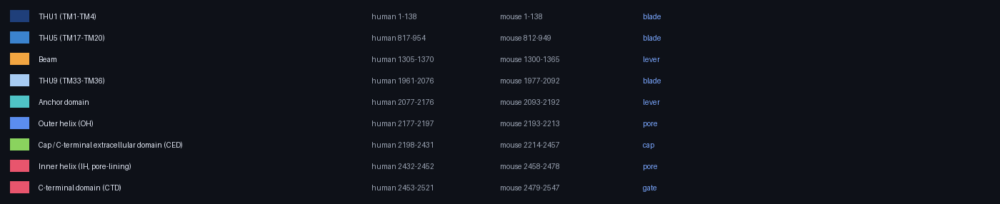
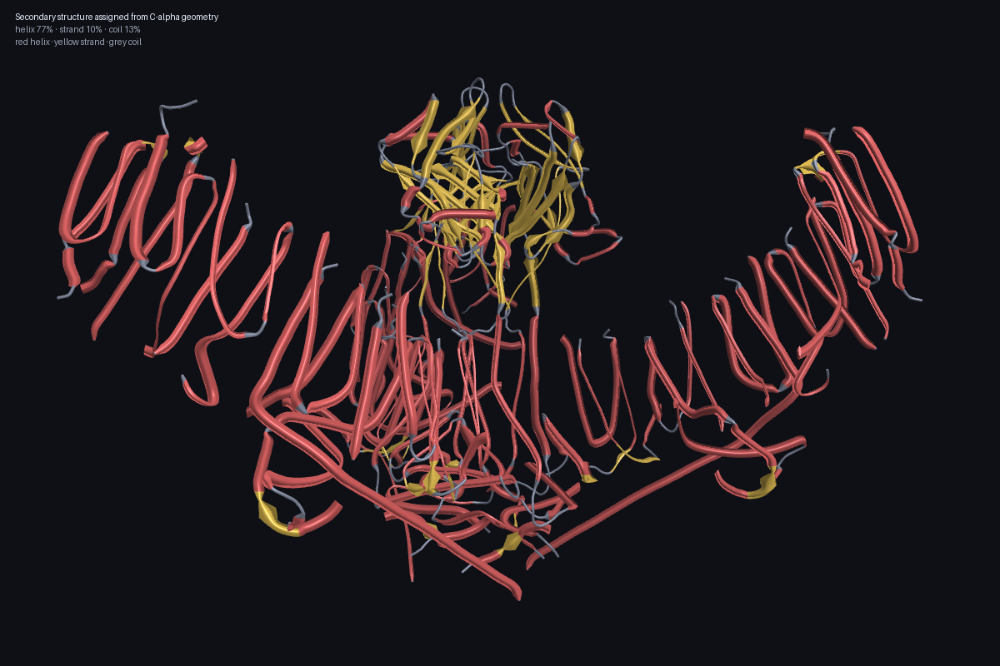

# PIEZO1 Dynamic Structural Simulator

An interactive, physics-driven 3D model of the **PIEZO1** mechanosensitive ion
channel — built to be both a teaching instrument and a research one.



*Human PIEZO1 (PDB 8YEZ, 3.3 Å), viewed down the three-fold axis. Blue: the
nine transmembrane helical units of the three mechanosensory blades. Green: the
extracellular cap. Red: the pore module. Orange: the beam — the intracellular
lever that carries blade motion to the gate.*

---

## Why PIEZO1

PIEZO1 converts mechanical force into an ionic current. It is how your
endothelium senses blood flow, how red blood cells set their volume, how
lymphatic valves form. Mutations in it cause hereditary xerocytosis and
lymphatic dysplasia, and one variant is carried by roughly a sixth of people of
African ancestry.

Its mechanism is inseparable from its shape. Three curved blades bend the
surrounding membrane into a **dome**. Tension flattens the dome, the blades
lever the pore open, ions flow. You cannot understand PIEZO1 from a sequence or
a static picture — you have to see it move.

That is what this project is for.

---

## What it does

**Renders the real structures.** Twenty-one curated PDB entries, including the
2025 human PIEZO1 structures and cryo-EM structures of three disease variants,
plus AlphaFold models for the distal blade that no experiment has resolved.

**Measures the membrane dome from coordinates.** Recovers the three-fold axis,
fits the mid-membrane surface, and reports the radius of curvature, dome depth
and excess area — numbers you can compare directly with the literature.

**Predicts the gating motion.** Builds an elastic network model over the C-alpha
trace and extracts its low-frequency normal modes, each labelled by its C3
symmetry. This is not decorative: isotropic membrane tension is itself
three-fold symmetric, so only the **A**-symmetric modes can couple to it. The
app tells you which modes are candidate gating coordinates and which symmetry
forbids.

**Maps variants onto structure honestly.** 68 curated variants, every wild-type
residue checked against the reference sequence, each one annotated with which
structures actually resolve it — and greyed out where none do.



*The gating transition, both panels on the same scale and orientation. Left:
curved mouse Piezo1 in a lipid bilayer. Right: the flattened state. Radius of
curvature measured by this code from the deposited coordinates.*

---

## The result that says it works

The headline validation is not that the app renders something pretty. It is
this:

> **An elastic network model built from the *closed* structure alone reproduces
> the experimentally observed gating transition, with an overlap of 0.705 for a
> single mode — and 100% of that overlap lies in the symmetry channel that
> theory permits.**

Comparing curved mouse Piezo1 (7WLT) with the flattened state (7WLU) over the
1274 residues resolved in all six protomers — a 19.7 Å trimer RMSD:

| | |
|---|---|
| Best single mode overlap with the observed change | **0.705** (mode 3, symmetry A) |
| Cumulative overlap over 40 modes | **0.964** |
| Best **E**-mode overlap | **0.0011** |
| Share of total overlap carried by A modes | **100.00%** |

Every E mode scores essentially zero, exactly as the symmetry argument
requires. The elastic network does not merely fit the transition; it finds it
through the right physical channel.

The dome geometry independently reproduces published values:

| Structure | State | Radius of curvature | Published |
|---|---|---|---|
| 7WLT | curved, bilayer | **9.7 nm** | 10.2 nm (Haselwandter & MacKinnon 2018) |
| 11YE | curved, native vesicle | **10.4 nm** | ~11.8 nm (Vaisey & MacKinnon 2026) |
| 7WLU | flattened | 18.4 nm | — |
| 11ZC | flat, native vesicle | 21.6 nm | — |

C3 axis recovery is exact: 120.00°, 0.00 Å RMSD.

---

## Animations



*The gating transition, morphed between the two experimental endpoints. Every
frame is captioned with what it shows and what was measured, and states plainly
that it is an interpolation rather than a simulated trajectory.*

```bash
python scripts/make_animations.py --list       # what is available
python scripts/make_animations.py              # render all as GIF
python scripts/make_animations.py --format mp4 # smaller, better quality
```

Seven animations ship: the gating morph, the lowest symmetric elastic-network
mode (labelled with its symmetry and what that permits), the Yoda1 pocket, the
PIP2 lysine cluster, the hydrophobic gate, the resolved pore lipid with its
detected contacts, and R2456H in structural context. Output goes to
`docs/anim/` and is git-ignored — it is regenerable.

---

## Install

```bash
git clone <this repo>
cd piezo1_simulation

# create the environment (conda or mamba, ~5 minutes)
bash scripts/create_env.sh
conda activate piezo1

# download all external data (~90 MB: structures, sequences, ligands)
python -m piezo1.io.fetch

# run
python -m piezo1
```

Requires a GPU supporting **OpenGL 4.1 core**. Verified on macOS (Apple
Silicon, Metal-backed GL 4.1); Linux and Windows should work but are untested.

---

## Using it



Drag to rotate, shift-drag to pan, wheel to zoom, `R` to reset, space to spin,
click any atom to identify it.

- **Model** — choose a structure; each shows its state, resolved residue range,
  numbering system, bound ligands and citation.
- **Annotation** — browse domains, functional sites and variants. Selecting one
  highlights it and explains what is known about it, with the PMID.
- **Physics** — measure the dome, compute normal modes, animate them, or colour
  the structure by per-residue displacement to see which parts a mode moves.

### Domain colour key



---

## Headless use

Everything the GUI computes is scriptable, and every result carries its
provenance.

```bash
python -m piezo1.cli list                       # what is available
python -m piezo1.cli dome 8YEZ --json           # membrane dome geometry
python -m piezo1.cli pore 11ZC                  # pore profile and bottleneck
python -m piezo1.cli modes 8YEZ --n-modes 30    # modes with symmetry labels
python -m piezo1.cli report 8YEZ -o report.md   # everything, with provenance
python -m piezo1.cli batch --analyses dome pore # across every structure
```

The batch run over all 20 structures reproduces the gating series in one
command — curved entries at R_c 9.3–12.5 nm, the 8IXO intermediate at 16.5,
flat 11ZC at 21.6 and the only one called conductive.

See [`docs/NOTEBOOK.md`](docs/NOTEBOOK.md) for the Python API.

---

## How it is built

```
io ──▶ core ──▶ structure ──▶ physics ──▶ analysis
                                  │
                   render ◀───────┴───────▶ ui
```

Nothing below `render` imports from the GUI, so the whole scientific engine can
be driven from a notebook or a test.

**Rendering** uses ray-cast **impostors**: a sphere is drawn as a four-vertex
screen-facing quad whose fragment shader solves the ray–sphere intersection and
writes `gl_FragDepth`. This is how PyMOL, VMD and ChimeraX get their speed, and
it means a 120 000-atom model stays interactive. A full PIEZO1 trimer renders in
14–20 ms.

**Secondary structure** is assigned from C-alpha geometry alone, because large
parts of the PIEZO1 cryo-EM models are backbone-only, where a hydrogen-bond
method such as DSSP cannot run at all.



**Elastic network modes** come from a sparse Hessian solved by shift-invert
Lanczos — 40 modes over 12 177 degrees of freedom in about 3 seconds.

See [`INTERFACE.md`](INTERFACE.md) for the module-by-module map and
[`docs/SCIENCE.md`](docs/SCIENCE.md) for the scientific basis and its sources.

---

## On numbering — please read this

Most PIEZO1 *mechanism* papers number residues by **mouse** Piezo1 (2547 aa).
Most *disease* papers number by **human** PIEZO1 (2521 aa). **The offset between
them is not constant.** It varies from 0 to +26 across the chain in twelve
distinct blocks, and it passes through zero twice.

Mouse A1718 and human A1718 are the same residue. Mouse E2496 is human E2470.
Getting this wrong silently highlights the wrong helix.

So this project never hard-codes a conversion. Everything goes through a real
global alignment in `piezo1.core.sequence`, and every residue number in the data
files states which system it is in. The build scripts verify each declared
residue against the actual reference sequence and refuse to ship a mismatch.

---

## Honesty features

These are deliberate, and they are the point of the project as a research tool:

- **Coverage is reported, not hidden.** 14 of the 68 curated variants —
  including the E756del malaria-associated allele — are not resolved in *any*
  human PIEZO1 structure. The viewer says so instead of highlighting nothing.
- **Provenance travels with every number.** Each domain records whether its
  boundaries came from UniProt, from a stated derivation rule, or from a paper,
  with a confidence label.
- **Unverifiable annotations are omitted.** Two domain names common in secondary
  sources ("clasp", "latch") were dropped because neither survived checking
  against the primary literature. Inventing boundaries would colour residues
  with false confidence.
- **Symmetry-forbidden modes are labelled as such**, so a user cannot mistake a
  degenerate E mode for a gating coordinate.

---

## Status

Working: data layer, structure model, dome geometry, elastic network models with
symmetry labelling, the renderer, and the GUI.

Planned: Helfrich membrane-footprint solver, tension-dependent Markov gating
kinetics, conformational morphing between states, pore-radius profiling, pocket
detection and optional docking. See [`INTERFACE.md`](INTERFACE.md) for status
per module and [`SESSION_LOG.md`](SESSION_LOG.md) for the reasoning behind past
decisions.

---

## Data sources

Structures from the [RCSB PDB](https://www.rcsb.org/); sequence and features
from [UniProt](https://www.uniprot.org/) (Q92508, E2JF22); predicted structure
from [AlphaFold DB](https://alphafold.ebi.ac.uk/); compounds from
[PubChem](https://pubchem.ncbi.nlm.nih.gov/). None of it is committed to this
repository — `python -m piezo1.io.fetch` regenerates all of it.

## Licence and citation

Research and educational use. This is not a clinical tool and nothing in it is
validated for diagnosis. If you use it in published work, please cite the
underlying structural and functional papers rather than this software — they did
the hard part.
