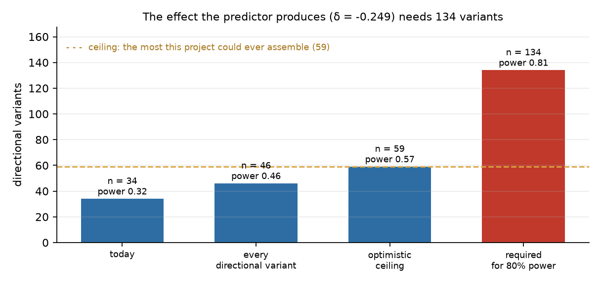

# What this project established, and what it could not

*Read this first. Everything else is the working.*

Every number below is computed by the code, not typed here: each comes from
`analysis.claims.CLAIMS`, `analysis.prediction_record.ALL_PREREGISTERED` or
`analysis.published_interval.HEADLINE`, and
`tests/test_conclusion.py` fails if this document states one they do not
support. That guard exists because this project has twice shipped prose that
went quietly stale.

---

## 1. What it set out to do

Build a PIEZO1 simulator good enough to **predict whether a variant causes gain
or loss of function from structure alone**, and validate that prediction blind
against 68 curated variants.

The structural machinery was the means. The prediction was the point.

---

## 2. What it established

These are measured, reproduced, and guarded against drift by `make verify`.

| Quantity | This project | Published | Agreement |
|---|---|---|---|
| Dome radius of curvature (7WLT) | **9.72 nm** | 10.2 nm (Haselwandter & MacKinnon 2018) | inside the interval |
| Half-activation tension T₅₀ | **2.71 mN/m** | 2.7 ± 0.1 mN/m (Lewis & Grandl 2015) | 0.4% |
| Membrane tension at κ = 20 k_BT, λ = 14 nm | **0.42 mN/m** | 0.42 mN/m | exact |
| Decay length recovered by the solver | **13.998 nm** | 14.0 nm by construction | 0.01% |
| Closed-state pore bottleneck (8YEZ) | **0.95 Å** | — | too narrow for a hydrated ion |
| Flattened-state bottleneck (11ZC) | **3.3 Å** | — | conductive |
| Wetting score, closed 8YEZ | **0.82** | Rao 2019 cutoff 0.55 | predicted to dewet |

Three results are the project's own rather than reproductions:

- **The linear membrane theory everyone uses overestimates PIEZO1's footprint
  by 3.65×.** At the dome's 63° contact slope the neglected terms are larger
  than the ones kept. Solving the nonlinear Euler–elastica instead changes the
  gating area from the linear route's 463 nm² to **70.9 nm²**.
- **A single symmetric elastic-network mode captures 0.705 of the
  closed-to-flat transition**, so the gating motion is one collective mode
  rather than a sum of many.
- **The closed pore is predicted to dewet rather than merely be narrow.** Both
  criteria are reported separately, because "would water leave?" and "does an
  ion fit?" are different questions.

---

## 3. What it could not establish

**The central claim.** Five pre-registered tests, five different predictor
families, five nulls:

| Round | Predictor | Cliff's δ |
|---|---|---|
| 7 | elastic-network ΔΔG | **−0.083** |
| 22 | FoldX ΔΔG | **−0.211** |
| 36 | substitution-aware ΔΔG | **−0.249** |
| 41 | regional missense constraint (gnomAD) | **−0.269** |
| 48 | wild-type structural context | **+0.036** |

Every interval crosses zero. Each was committed in its own commit before the
comparison ran, under `NEGATIVE_RESULT_PROTOCOL.md`.

The point estimate grew across the first four, which is suggestive and is not
evidence. Round 26 made the mechanical predictor sensitive to *which*
substitution occurred — within-position variance **0.525**, against a
pre-registered criterion of 0.20 — and the effect grew accordingly. It was
still not significant.

---

## 4. The result that makes this more than a list of nulls

**The claim is not merely unproven. It cannot be settled with data that could
exist.** Two independent routes, both closed by measurement rather than by
opinion.

**Across positions** (Round 47). The effect the best predictor produces needs
**134** directional variants for conventional power. The curated set supplies
34 that can be modelled. Adding every candidate a systematic literature harvest
could find, and assuming every one could be assigned a direction it does not
currently carry, reaches **59** — where power is roughly a coin flip.

**Within positions** (Round 54). Comparing two variants at the *same* residue
removes the between-position variance that consumed 99.8% of Round 7's
predictor, so it needs far fewer variants. It needs positions carrying two or
more missense variants that each have a direction, from sources that do not
disagree. Across 68 curated and 232 ClinVar variants there is **one**: R2456.
Three further variants — M870V, R1358C, A2020V — would each unlock one more if
a direction could be assigned; two of the three are curated as VUS *precisely
because* that evidence was not found.

So "we need more data" is the wrong conclusion. The right one is that **a sixth
test on this variant set should not be run, whatever predictor goes into it.**

---

## 5. Why the negative result is the useful output

The reusable product is not the predictor. It is the apparatus that established
the predictor could not be validated, and most of it is not PIEZO1-specific:

- **Pre-registration with a three-clause decision rule.** In Round 41 the
  p-value was below 0.05 and the result was still a null, because the effect
  interval spanned zero. A rule written as "p < 0.05" would have produced this
  project's only positive result on its weakest evidence.
- **Negative controls in every test.** In Rounds 41 and 48 a predictor chosen
  *because* it should be meaningless matched or beat every real endpoint. That
  is a stronger reason to disbelieve a result than any interval.
- **Feasibility before another attempt** (`analysis/feasibility.py`,
  `analysis/data_routes.py`): asking what the data could ever support, rather
  than running the test and explaining afterwards.
- **Calibrating every checking instrument** (`CLAUDE.md`, `tests/test_calibration.py`).
  Six times an *alternative* built to check the pipeline was itself wrong and
  returned a plausible number rather than an error.
- **Provenance that is measured, not declared** (`analysis/provenance_chain.py`):
  it found 26 registered parameters that appeared in the UI, were flagged in
  reports, and changed nothing.

---

## 6. What is not claimed

- **Not a clinical tool.** Nothing here is validated for diagnosis.
- **The measurements that worked still carry model uncertainty.** The dome
  radius is **9.72 nm** with a bootstrap interval of about ±0.9 nm — but fit an
  oblate spheroid instead of a sphere and the radius of curvature runs to
  **14.99 nm**. The spheroid fits *better*. What limits that number is the
  choice of shape, not the scatter of the points.
- **The permeation model overestimates conductance.** It gives about 41 pS
  against a published 25–30. Reported, not tuned.
- **Everything coarse-grained is coarse-grained.** The interactive dynamics are
  elastic-network modes, not molecular dynamics.

---

## 7. If you want to apply this to your own project

The apparatus in §5 is written up as a short methods note —
[`docs/METHODS_NOTE.md`](METHODS_NOTE.md) — aimed at someone building a
structural-biology tool around a prediction they believe in. It is organised
around what each mechanism *caught*, including nine occasions when a checking
instrument was itself the thing at fault.

---

## 8. Where to go next

`ROADMAP.md` Blocks P and Q list what remains, which is engineering and
communication rather than science: the two routes to the central claim are
closed by measurement, and Round 64 recorded in writing that no further test
will be attempted on this variant set.

The honest summary in one line: **the structural machinery works and reproduces
the literature; the variant prediction it was built for does not work, and the
data that would decide it does not exist.**
