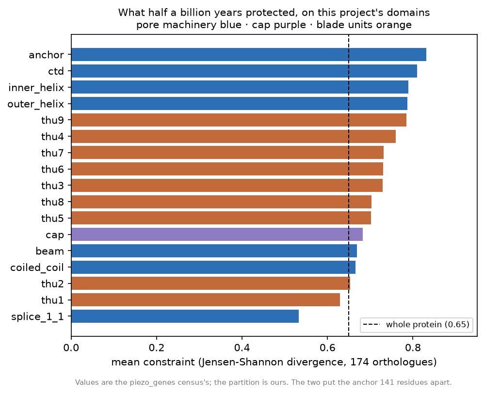
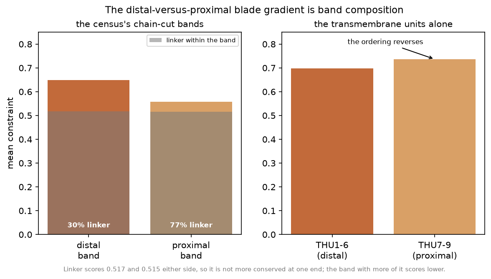
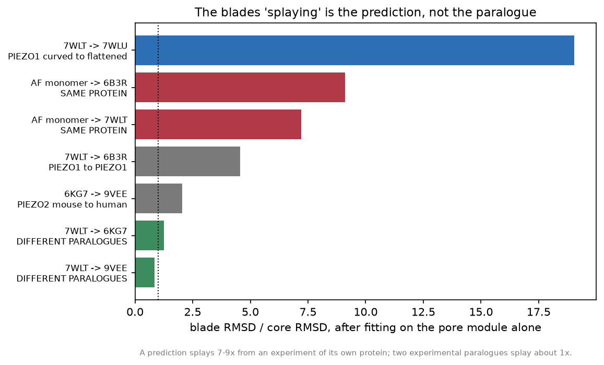
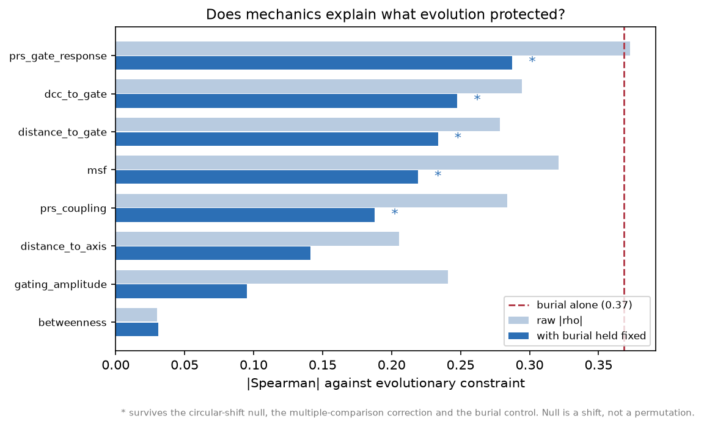

# The PIEZO family, imported — and what this project's coordinates say back

An account of what was brought in from the [`piezo_genes`](../../piezo_genes)
census, what this project could test about it, and the four places the answer
came out differently.

The census is a 194-genome, eukaryote-wide sweep of the PIEZO family: what its
true range is, that vertebrates have a **third** PIEZO gene the databases
largely missed, and which parts of the protein half a billion years of evolution
has refused to change. It is a sequence project. It has no coordinates, no
physics, and no way to ask *why* a residue is conserved.

This project is the mirror image: an elastic network, a membrane model and a
pore profiler, with no evolutionary depth of its own worth the name. Joining
them is the only way to ask the question neither could ask alone.

**Nothing here re-runs the census.** Its alignments and its statistic are
imported whole, behind a gate that re-reads every quoted number from the source
files on every build (`scripts/build_family_findings.py`). What is measured here
is what those numbers look like on coordinates, on this project's own domain
boundaries, and against this project's own controls.

---

## 1. What came across

Thirteen statements, in `piezo1/resources/family_findings.json`, each carrying
the numbers it rests on, the file they came from, what this project does with
it, and what it does not establish. Plus one bulk import: the **per-residue
constraint track** for human PIEZO1, human PIEZO2 and zebrafish piezo3 —
Jensen-Shannon divergence over 121–192 orthologues, one locus per genome.

Read them with `python -m piezo1.cli family`.

The import is gated three ways, and the third is the one that matters:

1. every quoted number is re-read from the census's own result files and
   compared, so a corrected number upstream fails the build rather than
   becoming a stale quotation here;
2. the build **refuses to write at all** if the census is not on disk, rather
   than re-stamping the resource with a fresh date and nothing behind it;
3. the PIEZO1 track's own amino acids are checked residue by residue against
   this project's copy of Q92508 — because a track joined to the wrong sequence
   produces a colouring that looks entirely plausible and is off by an indel.

---

## 2. What replicated

### The conserved core is the pore machinery

Measured on `domains.json` rather than on the census's bands — the two put the
anchor **141 residues apart**, so agreement is a property of the protein:

| domain | mean constraint | vs whole protein |
|---|---|---|
| anchor | 0.832 | +0.183 |
| CTD | 0.810 | +0.160 |
| inner helix | 0.789 | +0.140 |
| outer helix | 0.787 | +0.137 |
| … | | |
| THU2 | 0.653 | +0.003 |
| THU1 | 0.630 | −0.020 |



*Rebuild: `python scripts/make_family_figures.py`.*

### What the paralogues kept of each other

Recomputed from this project's own global alignment, over its own boundaries.
Whole protein 0.495 (PIEZO1 vs PIEZO2) and 0.474 (PIEZO1 vs piezo3):

| element | PIEZO1 vs PIEZO2 | PIEZO1 vs piezo3 | census |
|---|---|---|---|
| inner helix | 0.905 | 0.810 | 0.852 / 0.741 |
| CTD | 0.899 | 0.710 | 0.912 / 0.719 |
| anchor | 0.870 | 0.810 | 0.732 / 0.750 |
| **cap (CED)** | **0.404** | **0.430** | **0.402 / 0.378** |
| THU1 | 0.406 | 0.386 | — |

The cap is the exception the census says it is — the one piece of pore
machinery *below* the whole-protein figure — and it lands within a percentage
point of the census's own value from entirely different machinery.

### The two disease genes really do mutate the same residue

PIEZO1 R2456 (hereditary xerocytosis) and PIEZO2 R2686 (Gordon syndrome), and
PIEZO1 R2488 / PIEZO2 R2718. Tested three ways, in order:

1. **an independent alignment agrees** — this project's pairwise PIEZO1↔PIEZO2
   map pairs the same residues as the census's 117-sequence family alignment;
2. after superposing the two channels **by the pore module alone**, the C-alpha
   land 1.1–4.2 Å apart;
3. the claimed partner is the **nearest residue of the other paralogue, to
   within one residue**, in every comparison run.

Point 3 is the evidence, and point 2 is not. The whole pore module superposes —
the median aligned core pair is 2.5 Å apart — so a small distance is what every
pair gives. What distinguishes a correct correspondence from a register error is
which residue is nearest, and one residue is also the resolution a 3.5 Å
cross-paralogue fit can honestly claim.

### piezo3 kept all fourteen

Checked against a **different UniProt record** of the same zebrafish gene from
the one the census scored — the two differ by an inserted residue at ~2014, so
they are mapped by alignment and not by arithmetic. All fourteen pathogenic
pore-module positions carry the identical residue.

### The quoted family motif is not one

`PFEW` does not occur in any of the ten PIEZO reference sequences this project
now holds — 26,363 residues — with a positive control taken from human PIEZO1's
own sequence that the same search finds. What *is* conserved to whole-family
depth are short windows in the anchor, the outer helix and the CTD.

### Two conservation routes agree

This project's own per-residue conservation (Shannon entropy over 61 fetched
vertebrate orthologues) against the census's (JSD over 174 genome-backed loci):
**ρ = 0.88** over 2,521 positions. No data and no statistic in common.

---

## 3. What came out differently

Four results where asking the question here changed the answer. None overturns
a headline; two sharpen one, and two say what a finding is really about.

### 3.1 The distal-versus-proximal blade gradient is composition, not biology

The census reports that the *distal* blade is more conserved than the proximal
one, against what "peripheral means dispensable" predicts. Its bands reproduce
here exactly (0.649 and 0.558 against their 0.656 and 0.558), so the import is
sound. But the bands are a single chain cut, and they contain very different
amounts of the unstructured stretches between transmembrane units:

| | distal band | proximal band |
|---|---|---|
| constraint | 0.649 | 0.558 |
| fraction that is inter-unit linker | **29%** | **77%** |
| linker constraint within the band | 0.517 | 0.515 |
| **THU units only** | **0.698** | **0.737** |

Linker scores the same either side, so it is not more conserved at one end. The
band with more of it scores lower — and restricted to the four-TM units the
ordering **reverses**. The finding is boundary-dependent, and what survives the
composition is the opposite gradient.



### 3.2 The disease enrichment is real, and it depends on where the pore module starts

The census finds pathogenic missense concentrating in the pore module: odds
ratio 3.9, one-sided Fisher P = 0.0014, pooling PIEZO1 and PIEZO2 against
ClinVar benign labels. Re-tested here on PIEZO1 alone, against **gnomAD
population missense** — variation that exists in people rather than variation
somebody classified as harmless:

| boundaries | module size | pathogenic in | odds ratio | P |
|---|---|---|---|---|
| census | 18% | 12 / 29 | 3.63 | **0.0033** |
| ours | 14% | 6 / 29 | 1.60 | 0.25 |

On the census's boundaries the result replicates strongly with a completely
different comparator. On ours it does not reach significance. The two partitions
disagree about **120 residues** (2057–2176) — and those 120 residues carry six
pathogenic positions, including E2117 and T2127. That band is the result.

Separately, the census's constraint score still separates pathogenic from
population variation here at **AUC 0.82** against its own 0.91, with a negative
set that is not a clinical judgement at all. The score generalises past the
labels it was checked on.

### 3.3 The blades "splaying" is the prediction, not the paralogue

The census's structural finding: superposing the predicted zebrafish piezo3
model on cryo-EM mouse Piezo1 by the pore module alone puts the cores at 3.86 Å
while the blades splay visibly apart.

Generalised here to every pair, with the ratio of blade RMSD to core RMSD after
a core-only fit:

| pair | core | blades | splay |
|---|---|---|---|
| 7WLT → 7WLU (PIEZO1 curved → flattened) | 2.20 Å | 41.9 Å | **19.0×** |
| **AF mouse Piezo1 → 6B3R (same protein!)** | 4.90 Å | 44.6 Å | **9.1×** |
| AF mouse Piezo1 → 7WLT (same protein) | 4.60 Å | 33.2 Å | 7.2× |
| piezo3 model → 6B3R (cross-paralogue) | 5.26 Å | 16.4 Å | 3.1× |
| 6KG7 → 9VEE (PIEZO2, mouse → human) | 1.17 Å | 2.38 Å | 2.0× |
| 7WLT → 6KG7 (PIEZO1 → PIEZO2) | 3.74 Å | 4.68 Å | 1.2× |
| 7WLT → 9VEE (PIEZO1 → PIEZO2) | 3.57 Å | 3.01 Å | **0.8×** |
| 8YEZ → 9VEE (PIEZO1 → PIEZO2) | 3.79 Å | 9.46 Å | 2.5× |

An AlphaFold monomer splays **7.2–9.1×** from an experimental structure of the
protein it is a model *of*. Three experimental cross-paralogue pairs splay
**0.8–2.5×** — the widest of them, 8YEZ against 9VEE, on an entry resolving the
least blade. So the splay in the census's picture is a
prediction-versus-experiment artefact, not paralogue divergence — and the core
agreement it reports (3.9 Å) is matched by two experimental paralogues at
3.6–3.7 Å, which is the stronger version of the same claim.

The 19× at the top of the table is PIEZO1's own gating motion: the pore module
stays put and the blades sweep. Core-conserved and periphery-free is what
*flattening* looks like, measured within one protein.



### 3.4 `best_template` picks the wrong template for a new paralogue

`structure.assembly.best_template` chooses "same protein first, then most
residues resolved". piezo3 is nobody's same protein, so the rule falls through
to the PIEZO trimer that resolves most of itself — the worm PEZO-1 entry 9ZIS,
at **28%** identity and 13,839 inter-protomer clashes, against a PIEZO1 or
PIEZO2 trimer at 44–48% and ~3,000. The rule is right for the case it was
written for. `analysis.piezo3` chooses explicitly and prints the comparison.

---

## 4. The new question: does mechanics explain what evolution protected?

The census established *that* the pore machinery is conserved. It could not ask
*why*, because a sequence alignment contains no mechanics. This project has the
mechanics. `analysis/constraint_mechanics.py` correlates the imported constraint
against every column the elastic network produces — none of which has seen a
sequence from any other species.

Three controls, because a correlation is the easiest thing in science to
manufacture:

- **the null is a circular shift, not a permutation.** Both series are strongly
  autocorrelated along the chain; a permutation null destroys that and is far
  too easy to beat. Measured: the shift null's spread is more than 3× the
  permutation null's on autocorrelated series.
- **burial is partialled out.** Buried residues are conserved in every protein
  ever studied, for reasons that have nothing to do with mechanotransduction.
  Burial alone reaches |ρ| = 0.37 here, the strongest single predictor.
- **eight features are corrected together** (Benjamini–Hochberg), because one of
  eight clearing a threshold is not a result.

On 7WLT:

| feature | ρ | ρ with burial fixed | q |
|---|---|---|---|
| PRS response at the gate | **+0.373** | **+0.287** | 0.007 |
| cross-correlation with the gate | +0.295 | +0.248 | 0.007 |
| distance to the gate | −0.279 | −0.234 | 0.007 |
| mean-square fluctuation | −0.321 | −0.219 | 0.007 |
| PRS coupling | −0.284 | −0.188 | 0.007 |
| gating-mode amplitude | −0.241 | −0.095 | 0.007 |
| betweenness | +0.030 | +0.031 | 0.63 |
| *burial alone* | *−0.369* | — | — |

Five of eight survive all three controls. The signs are the census's picture in
mechanics: **residues mechanically coupled to the gate are constrained; residues
that move are free.** The effect is modest — a partial ρ of 0.29 against burial's
0.37 — and that is the honest size of it.



> **This result only appeared after a defect was fixed.** `build_feature_table`
> defaulted to *human* annotation whatever entry it was handed, so on a mouse
> entry — which 7WLT is, and which the Round 48 validation used — the
> hydrophobic-gate group, the blade range and the conservation profile were all
> looked up at human residue numbers against mouse coordinates. It survived
> because the feature-table test fixture is human. Before the fix,
> `prs_gate_response` correlated at −0.02; after it, +0.37. See §6.

---

## 5. piezo3 as a structure

The only structural representation of the third vertebrate PIEZO is one
AlphaFold model of the zebrafish protein — human piezo3 has been the pseudogene
`PIEZO1P2` since before the primate radiation. It is now a family reference
(`uniprot_zebrafish_piezo3.json`), a catalogue entry, and identifies at 1.000
against a runner-up of 0.068 with no other entry's identification moving.

Run through the pipeline (`python -m piezo1.cli piezo3`), it gives dome
R = 10.8 nm and a 0.37 Å bottleneck against 7WLT's 9.7 nm and 0.73 Å, measured
by the identical route. **Neither number is evidence about piezo3**: 96% of the
assembled trimer's departure from planarity is the template's arrangement, and
the protomer is a prediction whose blades this project has just measured to sit
33–45 Å from where cryo-EM puts them even for the protein the model is of.

What the numbers *can* do is fail, and they did not: the protomer arranges into
a closed trimer with an axis and a continuous lumen, which a protein not built
like a channel need not have done. That is a negative that survived, not a
positive demonstrated. No current has ever been recorded from any piezo3.

---

## 6. One defect this work found

`analysis/features.py` looked up three things at the wrong residue numbers on
any mouse entry: the hydrophobic-gate group, the blade range, and the
conservation profile (which is anchored on human Q92508 whatever entry it is
asked about). The human/mouse offset is not constant and reaches 26 residues.

Measured before and after, on 7WLT:

- the conservation column against the same profile read at the correct human
  residue: **ρ = 0.29 → 1.00**;
- `distance_to_gate` had no residue at zero; it now finds mouse 2473/2476/2480,
  which is what `functional_residues.json` says the gate is;
- `prs_gate_response` against constraint: **−0.02 → +0.37**.

The numbering now comes from `piezo1_numbering(structure)` and the
human-anchored profile is carried through `core.sequence`.

**`docs/PREREGISTRATION_ROUND48.md` records that Round 48's endpoints were built
by `build_feature_table` on 7WLT.** Round 48 is a frozen null result and is not
revised here — the standing policy is that a recorded result is superseded, not
edited — but its features were computed through this defect, and that is
recorded rather than left to be discovered.

---

## 7. Where to start

```
python -m piezo1.cli family                 # the thirteen imported statements
python -m piezo1.cli constraint 7WLT        # constraint on our domain partition
python -m piezo1.cli disease 7WLT           # the enrichment, under both partitions
python -m piezo1.cli coreperiphery 7WLT --partner 9VEE
python -m piezo1.cli piezo3 7WLT            # the third PIEZO, end to end
```

In the GUI: **Analysis → The PIEZO family census…** and the four entries below
it, and **View → Colour by evolutionary constraint**.

Rebuild the import with `python scripts/build_family_findings.py`, which
verifies every quoted number against the census's own files and refuses to write
if the census is not on disk.
