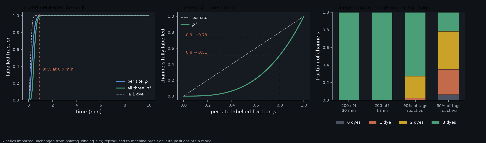
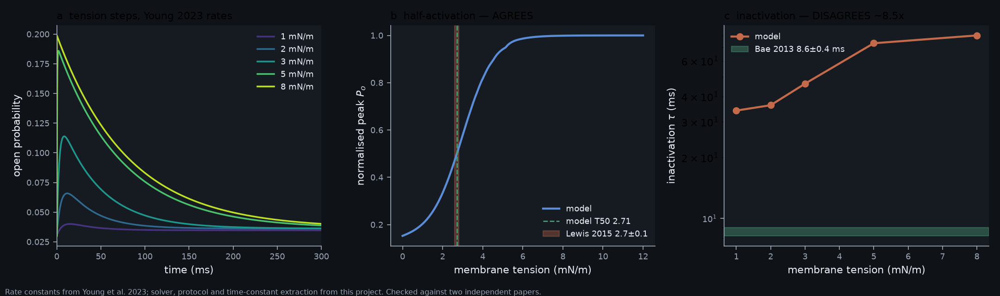

# The science behind the simulator

What this application models, what the numbers mean, and where each came from.
Full literature dossiers live in `ref/research/` (git-ignored; regenerable).

> **What the project established, and what it could not:**
> [`CONCLUSION.md`](CONCLUSION.md) — one page. The structural machinery
> reproduces the literature; the variant-effect prediction it was built for
> does not work, and five pre-registered tests returned five nulls.

---

## 1. The molecule

| | Human | Mouse |
|---|---|---|
| UniProt | Q92508 | E2JF22 |
| Length | 2521 aa | 2547 aa |
| Mass | 286.8 kDa | — |
| Transmembrane helices | 38 per protomer | 38 |
| Assembly | homotrimer, C3 | homotrimer, C3 |
| Identity (global alignment) | 82.5% to mouse | — |

PIEZO1 is one of the largest polytopic membrane proteins known. Each protomer
contributes 38 transmembrane helices: TM1–36 form **nine four-helix
transmembrane helical units (THUs)** that make up a curved blade, TM37 is the
**outer helix**, and TM38 is the **inner helix** that lines the pore.

Note that NCBI's RefSeq summary still describes PIEZO1 as having 36
transmembrane segments and forming a homotetramer. Both are wrong; the cryo-EM
structures settled it.

### Domain architecture (human Q92508 numbering)

| Domain | Human | Mouse | Provenance |
|---|---|---|---|
| THU1 (TM1–4) | 1–138 | 1–138 | UniProt TM features, grouped in fours |
| THU2 | 195–330 | 202–337 | " |
| THU3 | 418–530 | 425–536 | " |
| THU4 | 575–696 | 581–702 | " |
| THU5 | 817–954 | 812–949 | " |
| THU6 | 995–1118 | 990–1113 | " |
| THU7 | 1154–1302 | 1149–1297 | " |
| Beam | 1305–1370 | 1300–1365 | literature (approximate) |
| Beam coiled coil | 1339–1370 | 1334–1365 | UniProt coiled-coil feature |
| Piezo1.1 spliced segment | 1388–1411 | 1382–1405 | PDB 6LQI |
| THU8 | 1657–1801 | 1657–1801 | UniProt TM features |
| THU9 | 1961–2076 | 1977–2092 | " |
| Anchor | 2077–2176 | 2093–2192 | derived: cytoplasmic domain between TM36 and TM37 |
| Outer helix (OH) | 2177–2197 | 2193–2213 | derived: TM37 |
| Cap / CED | 2198–2431 | 2214–2457 | derived: extracellular domain between TM37 and TM38 |
| Inner helix (IH) | 2432–2452 | 2458–2478 | derived: TM38 |
| CTD | 2453–2521 | 2479–2547 | derived: cytoplasmic domain after TM38 |

THU1 is the **pore-distal** end of the blade. The derivation was checked four
independent ways: mouse UniProt's separately curated TM coordinates land where
the alignment predicts for all 38 helices; PDB 4RAX's cap construct (mouse
2214–2457) reproduces the derived cap exactly; the 2025 human structural paper
places E756del at the THU4/THU5 linker and A1988V at the THU9 linker, both
matching; and InterPro PF24874 ("THU9 and anchor domain", 1958–2195) brackets
the derived THU9 + anchor.

**Deliberately omitted:** "clasp" and "latch". Neither survived verification —
"clasp" is not an established PIEZO1 term and appears to conflate the latch with
Guo & MacKinnon's cross-helices, and "latch" is used inconsistently with no
agreed residue range.

---

## 2. Cross-species numbering

This is the single largest source of silent error in the PIEZO literature, and
the project treats it as a first-class problem.

**The human↔mouse offset is not constant.** A global alignment (Biopython
`PairwiseAligner`, BLOSUM62, gap −11/−1; 82.5% identity, 2566 alignment columns)
gives twelve distinct offset blocks:

| Human range | Offset | Contains |
|---|---|---|
| 1–155 | 0 | THU1 |
| 156–488 | +7 | THU2, start of THU3 |
| 490–737 | +6 | end of THU3, THU4 |
| 753–777 | −6 | acidic low-complexity (unreliable) |
| 778–1375 | −5 | THU5–7, beam, coiled coil |
| 1377–1462 | −6 | Piezo1.1 spliced segment |
| 1466–1638 | −9 | disordered (unreliable) |
| 1639–1817 | 0 | THU8, Yoda1 residue A1718 |
| 1818–1910 | +6…+15 | disordered, dense indels (unreliable) |
| 1911–2393 | +16 | THU9, anchor, OH, most of cap, PIP2 cluster |
| 2394–2399 | +17 | |
| 2400–2521 | +26 | end of cap, IH, CTD, R2456, E2470 |

Consequences worth memorising:

- Mouse **A1718 = human A1718** — the same number, by coincidence. Do not
  generalise from it.
- Mouse **E2496 = human E2470**. Human E2496 is a *different residue*.
- Mouse **E2133 = human E2117**; mouse **S2472 = human S2446**; mouse
  **S1330 = human S1335**; mouse **R2482 = human R2456**.
- Mouse **K2182–K2185 = human K2166–K2169** — the same PIP2-binding lysine
  cluster. This equivalence was flagged as unverified in the literature review
  and is settled here by direct alignment, with byte-identical 29-residue
  sequence context.

Everything in the codebase converts through `piezo1.core.sequence`, never by
adding a constant.

---

## 3. The dome model of mechanotransduction

PIEZO1's blades are intrinsically curved, and they bend the surrounding bilayer
into a dome that bulges towards the cytoplasm. Because the dome's *projected*
in-plane area is smaller than its *surface* area, flattening it under tension
increases the projected area of the protein-plus-membrane unit. Membrane tension
T acting through an area change ΔA supplies the gating energy:

    ΔE = −T · ΔA

This is the essential physics: PIEZO1 is a channel gated by an area change, and
the area change comes largely from the *membrane* it deforms, not from the
protein alone.

### Measured and published geometry

| Quantity | Value | Source |
|---|---|---|
| Radius of curvature, closed | 10.2 nm | Haselwandter & MacKinnon 2018, *eLife* |
| Radius of curvature, outside-in | ~11.8 nm | Vaisey & MacKinnon 2026, *Sci Adv* |
| Mid-bilayer dome area | ≈390 nm² | Haselwandter & MacKinnon 2018 |
| Dome is protein/lipid | ~20% / ~80% | " |
| Footprint decay length λ | 14 nm | " |
| Membrane bending modulus κ | 20–25 k_BT | Haselwandter 2018; Dixit 2025 |
| Intrinsic radius R₀ | 42 ± 12 nm | Haselwandter 2022, *PNAS* |
| Protein stiffness K_P | 18 ± 2.1 k_BT | " |
| Flattening force constant | 60 ± 20 pN/nm | Dixit, Noé & Weikl 2025, *eLife* |
| Dome depth | 6–7 nm | Chong et al. 2021 |
| CED displacement on flattening | ~12 Å | Vaisey & MacKinnon 2026 |

**The footprint matters more than the dome.** Haselwandter & MacKinnon's key
result is that the membrane deformation extending *beyond* the protein, decaying
over λ ≈ 14 nm, dominates the tension sensitivity — not the dome itself.

### The footprint, solved

The linearised Helfrich energy in the Monge gauge,

    E = ∫ [ (κ/2)(∇²h)² + (γ/2)|∇h|² ] dA

minimises to κ∇⁴h − γ∇²h = 0, whose axisymmetric decaying solution is
`h(r) = A·K₀(r/λ)` with **λ = √(κ/γ)**. For a fixed contact slope `s` at the
inclusion radius `r₀` the energy has the closed form

    E = π κ s² (r₀/λ) K₀(r₀/λ) / K₁(r₀/λ)

Note the direction of that Bessel ratio — inverting it gives an answer 2.5×
too large at the r₀/λ where PIEZO1 sits.

Our solver reproduces this to second order and recovers λ = 13.998 nm from its
own output against an input of 14.0 nm.

**Intervals (Rounds 29 and 52).** Each headline number is quoted with its
**widest** term, named for what kind of spread it is. Quoting a bootstrap
interval when a larger model spread exists is overconfident even when every
individual figure is correct, and Round 38 measured that this is exactly the
dome's situation.

| Quantity | Value | Published interval | Kind |
|---|---|---|---|
| Dome radius of curvature (7WLT) | 9.72 nm | **[9.45, 14.99] nm** | model form — *not* a CI, and a **lower bound** |
| Lowest A-mode gating overlap | 0.705 | **[0.554, 0.723]** | sensitivity to the network cutoff — *not* a CI |
| Half-activation tension T₅₀ | 2.711 mN/m | **[2.584, 2.838] mN/m** | propagated from the Young 2023 rates at ±20% |
| Nonlinear footprint energy | 25.27 k_BT | **[25.27, 26.94] k_BT** | propagated from κ = 20–25 k_BT |

**The dome is the one that changes.** Its bootstrap interval over the 66
transmembrane surface points is [8.80, 10.30] nm, and the choice of outlier
trim moves it only 0.30 nm — but a sphere and an oblate spheroid fitted to the
same points give radii of curvature of 9.45 and 14.99 nm. The spheroid fits
*better* (rmse 5.24 Å against 6.18 Å) with flattening +0.431, so the surface is
not spherical. The sphere remains the comparator because the published 10.2 nm
is itself a sphere fit — and 10.2 nm still lies inside the bootstrap interval,
so the agreement with Haselwandter & MacKinnon stands — but what limits this
number is the shape assumption, not the point scatter. **±0.9 nm was answering
a question nobody asked.**

*A mismatch found while doing this and kept rather than quietly repaired:* the
model comparison is anchored on the **untrimmed** sphere fit (9.45 nm) while
the published value is trimmed (9.72 nm). The 0.27 nm gap is small against a
5.54 nm model spread, so the conclusion is unaffected, but the two were not
like-for-like.

**T₅₀ is limited by its inputs, not its solver.** The matrix exponential and an
adaptive ODE integration agree to 0.6% (2.711 vs 2.727 mN/m). Perturbing the
published rate constants by ±20% moves it to [2.584, 2.838], sixteen times
wider — and the measured 2.7 ± 0.1 mN/m lies inside, so the agreement with
Lewis & Grandl survives the uncertainty on the inputs rather than depending on
their exact values.

Ensemble PC1 is **0.900 [0.796, 0.972]** over ten structures, which is a genuine
bootstrap: structures were resampled. None of these captures every kind of
error — a bootstrap says how well a sphere fit is determined, not whether a
sphere was the right shape, and a model spread over two shapes does not bound
the error from above, because both may be wrong the same way.

**But it must not be applied to PIEZO1 at face value.** The dome meets the
bilayer at a contact slope near 2.0, about 63°. The Monge expansion drops terms
of order |∇h|², so at that slope the neglected terms are *larger than the ones
kept*. Round 3 nonetheless quoted the linear output — 622 nm² of footprint
excess area against the dome's own 256 nm², "about 2.4× as much deformable area
as the dome" — with a caveat attached. Round 18 solved the nonlinear problem
and found the caveat was not strong enough: **that number was wrong by 3.5×,
and the conclusion drawn from it reverses.**

### The footprint without the small-slope approximation

Parametrising the meridian by arc length ``s``, with ``ψ`` the tangent angle,
gives the principal curvatures exactly — ``c₁ = ψ̇``, ``c₂ = sin ψ / r`` — with
no expansion anywhere. Minimising the Helfrich energy subject to ``ṙ = cos ψ``
yields a first-order system in ``(r, z, ψ, M, η)`` solved as a boundary-value
problem (`piezo1/physics/elastica.py`). Because the Lagrangian has no explicit
``s`` dependence its Hamiltonian is conserved and equals the axial force, which
is zero for an inclusion nobody is pulling on; imposing that and then measuring
its drift gives a free error estimate, ~1e-11 in practice.

At the measured 7WLT geometry (inclusion radius 8.69 nm, contact slope 1.99):

| Quantity | Linear (Monge) | Nonlinear (elastica) | Linear error |
|---|---|---|---|
| Footprint energy | 92.2 k_BT | **25.3 k_BT** | 3.65× too large |
| Footprint excess area | 622 nm² | **179 nm²** | 3.48× too large |

The two theories agree where they should: the relative discrepancy divided by
slope² converges to a constant (0.746), confirming the error is exactly the
O(|∇h|²) the expansion discards, and at a slope of 0.05 the two energies differ
by 0.2%. The correction factor is stable across the published parameter range
(κ = 20–25 k_BT, γ = 0.42–3.0 mN/m gives 3.46–3.67×) and invariant to domain
truncation from 8λ to 40λ, grid and solver tolerance.

**The conclusion that changes.** Round 3's comparison was not like for like: the
dome's 256 nm² is an *exact* area difference measured from the fitted cap, while
the footprint's 622 nm² was *linearised*. Measured consistently, the footprint
holds **179 nm², i.e. 0.70× the dome's excess area — less than the dome, not
2.4× more**. The claim that the surrounding membrane holds most of the
deformable area is therefore not supported by our own calculation.

This does *not* refute Haselwandter & MacKinnon. Their argument is about the
footprint's contribution to tension *sensitivity* — the area released between
closed and open states — and absolute stored area was never the right proxy for
it. Round 3's error was to present one as the quantitative form of the other.
What can be said from our numbers is narrower and firmer: at PIEZO1's contact
slope the linearised footprint is not quantitatively usable, and the corrected
areas of dome and footprint are comparable, with the dome slightly larger.

### The footprint in the gating area change (Round 28)

ΔA is a **change** between states, not an absolute area. Measured from the
deposited pair — 7WLT closed (R_c 9.72 nm, contact slope 1.992, 63.3°) and 7WLU
flattened (R_c 18.38 nm, slope 0.839, 40.0°) — two terms contribute: the dome's
projected area grows by **201 nm²**, and the surrounding footprint releases the
excess area it was storing.

The nonlinear correction bites harder on the *difference* than on either
endpoint, because the closed state sits where the linear theory fails badly and
the open state where it does not:

| | linear | nonlinear |
|---|---|---|
| footprint stored, closed (63°) | 622 nm² | 179 nm² |
| footprint stored, open (40°) | 159 nm² | 108 nm² |
| **footprint released on opening** | **463 nm²** | **71 nm²** |
| total ΔA with the dome term | 664 nm² | **272 nm²** |

The resulting T₅₀ = ΔG₀/ΔA moves from **0.060 to 0.147 mN/m** — toward the
measured 2.7 ± 0.1, not away, so the linear version was not accidentally right.

**It remains ~18× too low.** Improving the membrane physics by a factor of six
moved the answer by a factor of 2.4. That is the useful finding: the
structural-versus-functional discrepancy below is **not a membrane-modelling
error**, and no further refinement of the footprint will close it.

### An unresolved discrepancy, stated plainly

Reported area changes for gating differ by more than an order of magnitude
depending on how they are obtained:

- **Functional** ΔA from Boltzmann fits to tension–response curves: **6–20 nm²**
  (e.g. 8 ± 1 nm², Cox et al. 2016).
- **Structural/simulated** nanodome excess area: **~40 nm²** at zero tension
  (Dixit 2025), ~120 nm² projected (Guo & MacKinnon 2017), ~300 nm² in-plane
  expansion (Yang et al. 2022), up to 500 nm² by some measures.

These are measuring *different quantities* and should not be quoted
interchangeably. The dome model makes the consequence explicit by computing the
half-activation tension each would imply, holding ΔG₀ = 9.7 k_BT fixed:

| ΔA source | ΔA (nm²) | Kind | Implied T₅₀ (mN/m) |
|---|---|---|---|
| Cox 2016 | 8 | functional | **4.99** |
| Dixit 2025 | 40 | structural | 1.00 |
| Guo & MacKinnon 2017 | 120 | structural | 0.33 |
| Yang 2022 | 300 | structural | 0.13 |

Measured T₅₀ is 2.7–5.1 mN/m. The functional area reproduces it — which is a
consistency check, since all three of Cox's numbers come from the same fit —
while the structural areas under-predict the threshold by 5–40×. They are not
the gating area.

### What this code measures

Taking the mid-point of each of the 38 transmembrane helices in each protomer as
a sample of the mid-membrane surface, recovering the three-fold axis, and
fitting a sphere:

| Structure | State | R_c | Dome depth | Excess area |
|---|---|---|---|---|
| 7WLT | curved, bilayer | **9.7 nm** | 4.9 nm | 256 nm² |
| 11YE | curved, native vesicle | **10.4 nm** | 4.6 nm | 293 nm² |
| 8YEZ | human apo | 12.0 nm | 5.8 nm | 279 nm² |
| 8ZU3 | human + MDFIC | 12.5 nm | 5.4 nm | 270 nm² |
| 7WLU | flattened | 18.4 nm | 2.5 nm | 379 nm² |
| 11ZC | flat, native vesicle | 21.6 nm | 3.5 nm | 335 nm² |

The curved values sit squarely on the published 10.2 nm. This is the standing
regression test for the geometry pipeline.

*Caveat:* curved and flat entries resolve different residue ranges, so their
footprint radii are not directly comparable without restricting to commonly
resolved residues.

---

## 4. Elastic network models and the symmetry argument

An anisotropic network model treats each C-alpha as a bead joined to its
neighbours by harmonic springs. Its low-frequency normal modes describe the
large collective motions that all-atom simulation cannot reach for a
2500-residue trimer.

### Why symmetry labelling is not decoration

PIEZO1 is a C3 homotrimer, so every normal mode carries an irreducible
representation label: **A** (totally symmetric) or **E** (a degenerate pair).
Isotropic membrane tension is itself C3-symmetric. By the standard
group-theoretic selection rule, **only A modes can couple to it at first
order.** Identifying the lowest A mode therefore identifies the candidate gating
coordinate, and E modes can be excluded on principle rather than by inspection.

The application computes the character ⟨u, Su⟩ where S rotates by 120° and
permutes protomers; it comes out at exactly +1.000 for A modes and −0.500 for E
modes on real structures.

### The validation

Curved 7WLT versus flattened 7WLU, 1274 residues common to all six protomers,
19.7 Å trimer RMSD after superposition:

| | |
|---|---|
| Best single mode overlap | **0.705** (mode 3, symmetry A, collectivity 0.610) |
| Cumulative overlap over 40 modes | **0.964** |
| Best E-mode overlap | **0.0011** |
| Fraction of overlap² in A modes | **100.00%** |

An overlap of 0.7 for a single mode against a 19.7 Å conformational change is
high by the standards of the ENM literature. The complete absence of E-mode
overlap is a strong internal consistency check: the observed transition is
C3-symmetric, and the analysis recovers that without being told.

### The experimental ensemble agrees

The single-transition test above uses one pair of structures. A stronger test
asks whether the elastic network predicts the direction the *whole deposited
record* varies in. Principal component analysis over 10 mouse PIEZO1
structures, placed on a shared 1091-residue basis in human numbering:

| | |
|---|---|
| Variance in PC1 | **90.0%** |
| PC1 overlap with ANM mode 6 (symmetry A) | **0.804** |
| Cumulative overlap over 30 modes | **0.960** |
| RWSIP, 8 components vs 8 modes | **0.555** |
| Random-vector control | 0.001 |

PC1 orders the structures by gating state without ever being told what those
states are — seven curved entries negative, the intermediate at +334,
flattened at +678, flat at +1045. And the top three principal components all
match **A**-symmetric modes, even though E modes outnumber them two to one.

Two exclusions were necessary and both are instructive. **6KG7 is PIEZO2**, a
40%-identity paralogue; it is a different protein and does not belong in this
ensemble. **6LQI is the Piezo1.1 splice isoform** missing residues 1382–1405,
so what distinguishes it is sequence, not conformation — included, it dominates
a component on its own and splits the gating coordinate across PC1 (58%) and
PC2 (36%).

### A trap this exposed

Deposited chain labels do **not** reliably indicate rotational order around the
symmetry axis. 7WLT and 7WLU label their protomers in opposite senses.
Superposing by chain label gave 71.2 Å RMSD instead of 19.7 Å, and any
difference vector built that way is meaningless. Protomer correspondence is now
always determined by superposition
(`piezo1.structure.superpose.match_protomers`).

### The B-factor check, run at last (Round 82)

The standard question about any elastic network is whether its predicted
mean-square fluctuation tracks the deposited B-factor. Every structure here
carries one for every atom, and until Round 82 no analysis had read one.

**The column has to be checked before the network is.** A cryo-EM B-factor
absorbs local resolution, sharpening and the refinement's own restraints, so
three kinds of column are refused rather than correlated: a uniform one, a
**grouped** one (3JAC and 6BPZ carry 212 distinct values over ~2,700 C-alphas,
one per thirteen residues), and an AlphaFold model, whose B column holds
**pLDDT** — a confidence that runs the other way. That last is not a
hypothetical: build the network on the AlphaFold monomer and its own column
anti-correlates at Spearman **−0.57**, which is what the gate exists to stop
being reported as a result.

**Every correlation is reported beside a control that uses no network at all.**
A residue with more neighbours moves less in any packed solid. Contact number
needs no Hessian, no eigenvalues and no gating coordinate, so if the network
does not beat it the agreement is burial wearing a mechanism's clothes.

| | Network | Contact-number control |
|---|---|---|
| Median Spearman | **0.74** | 0.32 |
| Median Pearson | **0.48** | 0.39 |
| Entries where it wins (Spearman) | **13 of 15** | — |
| Entries where it wins (Pearson) | **9 of 15** | — |

**So the network orders residues by mobility much better than burial does, and
predicts the size of the mobility barely better.** Both numbers are stated
because quoting either alone misrepresents it. The rank correlation is the one
to read — the relationship is monotone but strongly non-linear, so Pearson is
dominated by a few very mobile residues.

Three further results are worth recording rather than smoothing:

- **18 of 21 entries can answer.** The three that cannot say why: two grouped
  refinements and one monomeric fragment (4RAX).
- **Three entries have a *negative* control** — 8YEZ, 8ZU8 and 6B3R — meaning
  their B-factor *rises* with burial, which no mobility does. On the first two
  the network gets 0.10, and the honest reading is that the column is not a
  temperature factor rather than that the network failed. Those three are
  excluded from the counts above.
- **The two entries the network loses on are 6KG7 and 8IXN**, named in the test
  so that a change in either reopens the question. 6KG7 is PIEZO2 — the
  paralogue — where burial predicts the column at 0.55 and the network at 0.07.

### PIEZO2, the only control on whether any of this is PIEZO1 (Round 83)

6KG7 was fetched, entity-classified and then excluded from every ensemble as a
paralogue. That is right for a PIEZO1 ensemble and wrong as a final answer:
PIEZO2 is the only thing available that separates *PIEZO1 does this* from *a
PIEZO does this*.

**The registry was wrong about it.** The note said 6KG7 "resolves residues
8-823". It resolves **8-2822 in sixteen segments, 1,817 C-alphas per
protomer** — more than any PIEZO1 entry in the catalogue (1,223 to 1,502) —
including all 38 transmembrane helices. Corrected, and checked by a test
against the file itself.

**Which protein and which numbering are measured, not assumed.** Every entry is
scored residue by residue against all four committed UniProt sequences. Each
matches exactly one at **1.000** with the runner-up below 0.25; 6KG7 matches
**mouse Piezo2** (Q8CD54, 2,822 aa), not human PIEZO2's 2,752. Three lengths,
no constant offset, and reading the wrong one shifts every helix silently.

**The naive comparison is a coverage artefact.** Measured directly, PIEZO2's
dome looks dramatically different. Restricted to the transmembrane helices both
entries resolve — paired by index, a pairing the global alignment confirms for
**37 of 38** helices — it does not:

| | R_c (nm) | depth (nm) | excess area (nm²) | TM helices |
|---|---|---|---|---|
| PIEZO1 7WLT | 9.72 | 4.92 | 256 | 22 |
| PIEZO2 6KG7, naive | 11.50 | 8.51 | 462 | 38 |
| PIEZO2 6KG7, coverage-matched | **10.32** | **5.64** | **227** | 22 |

The difference was in what each file contains, not in what the proteins are.
That is a caveat on this project's own dome numbers too: depth and excess area
scale with how much blade an entry resolves, and only the radius of curvature
is robust to it.

**The comparison got much sharper once human PIEZO2 was in the catalogue.** A
search for deposited PIEZO structures found six the catalogue was missing, two
of them **human PIEZO2** (9VEE, 9VEF) — so the paralogue question no longer has
to cross a species boundary as well:

| | overlap with PIEZO1's gating mode | in PIEZO2's symmetric subspace | control |
|---|---|---|---|
| mouse PIEZO1 → mouse PIEZO2 (6KG7) | 0.804, its **7th** A mode | 0.925 | 0.190 |
| human PIEZO1 → human PIEZO2 (9VEE) | **0.962**, its **lowest** A mode | **0.981** | 0.116 |

Within one species, PIEZO1's candidate gating coordinate is essentially
PIEZO2's lowest symmetric mode. The cross-species comparison had been diluting
the result, not creating it.

The same search added the two **invertebrate** PIEZOs — *C. elegans* PEZO-1
(9UOY, 9ZIT) and *Drosophila* PIEZO (9W7X). They are neither PIEZO1 nor PIEZO2,
because that duplication is vertebrate, and they do not share the 38-helix
architecture the domain table is built on: PEZO-1 has **36** and dPIEZO **40**.
Nothing here may transfer a helix index to them by number, and a test enforces
that. 9W7X turned out to be a third splice-isoform case — deposited in an
isoform's own numbering, **+3 after residue 1570** — found by the numbering
check rather than by reading the paper.

**Two deposited entries are not in the numbering this project reads them in.**
The identification built for the paralogue comparison found both, and both are
live — domains, helices, variants and functional residues are all applied by
residue number:

| Entry | What is wrong | Extent |
|---|---|---|
| 6LQI | deposited in the Piezo1.1 isoform's own continuous numbering across its 1382–1405 deletion; **+24** after the splice site | 764 of 1,301 resolved residues |
| 8ZU3, 8YFC, 9VMX, 8YFG | residues **767–857 numbered 22 low**; 8YEZ resolves the same region without the fault | 91 residues each |

Both are recorded as Round 86 rather than fixed here. A third apparent case was
not one: 3JAC scored 0.623 and every single mismatch turned out to be a `UNK` —
the depositor declining to name a residue, not disagreeing about one. Excluding
unassigned residues it matches at 1.000 over the 572 it names.

**The gating coordinate belongs to the fold.** With the sites coverage-matched
through the alignment (1,236 per protomer), the protomer correspondence
searched rather than read off chain labels — it is **(2, 0, 1)**, so the labels
would have been wrong — and PIEZO2's modes rotated into PIEZO1's frame:

| | |
|---|---|
| Overlap of PIEZO1's lowest A mode with one PIEZO2 A mode | **0.804** |
| Fraction lying in PIEZO2's symmetric subspace | **0.925** |
| Shuffled-correspondence control | 0.190 |
| Superposition RMSD over 3,708 C-alphas at 48% identity | 4.36 Å |

**So the motion this project identified as the candidate gating coordinate is
not specific to PIEZO1.** PIEZO2 has it too, lower in its symmetric subspace
and at a different place in its spectrum. That is a statement about generality
rather than a failure — and it cuts both ways. It means the elastic-network
mechanism is a property of the PIEZO fold, and it means nothing in that
mechanism distinguishes the two proteins, whose inactivation kinetics and
tissue roles differ. With one PIEZO2 structure, it says the fold *admits* the
mechanism, not that every PIEZO uses it.

---

## 4b. The pore, measured from coordinates

The pore-radius profile is the largest sphere that fits at each height along
the three-fold axis without overlapping any van der Waals surface, with the
probe tethered within 8 Å of the axis.

**The leash is not a convenience, it is a correctness requirement.** The
clearance function has no interior maximum — a free probe leaves the pore
sideways and finds bulk solvent, growing without bound. Unconstrained on real
PIEZO1 coordinates it reaches R ≈ 6188 Å, which is a true maximum and a
completely useless answer.

Measured on the closed human structure 8YEZ:

| Feature | z (Å) | Radius (Å) | Lining |
|---|---|---|---|
| Transmembrane hydrophobic gate | −17.7 | **3.01** | 2449, 2450, 2451 |
| CTD constriction 1 | −46.2 | **1.24** | M2467 |
| CTD constriction 2 | −55.2 | **0.76** | 2509, 2514 |

The global bottleneck is 0.76 Å, so the structure is not conductive — correct
for a closed channel. The flat, open-like 11ZC gives 3.25 Å and is conductive.

These constrictions were found from coordinates alone. That they coincide with
the residues independently curated from the literature as the hydrophobic gate
(I2447/V2450/F2454) and the CTD constrictions (M2467/F2468, P2510/E2511) is a
mutual validation of the profiler and the annotation.

Note that HOLE cannot be used here: it has no Apple-Silicon build, and
MDAnalysis's `hole2` wrapper is an empty stub as of 2.10.

### Radius is not conduction: hydrophobic gating

A pore can be wide enough for a hydrated ion and still block, because a
hydrophobic neck expels liquid water. Rao et al. 2019 (PNAS 116:13989)
quantified this over ~200 channel structures and ~600 MD simulations and report
that **minimum radius alone predicts the conductive state at AUROC 0.59**,
against **0.91** for radius combined with local hydrophobicity. Their result is
a free-energy landscape over (hydrophobicity, radius); residues above
1 RT = 2.6 kJ/mol are flagged and the sum of their shortest distances to that
contour, Σd, calls a channel closed above 0.55.

We use their published landscape directly — CHAP ships it under the MIT licence
— rather than redrawing the boundary from a figure. As a check that we index it
correctly, the extracted 1 RT contour gives a critical radius rising from
**0.10 nm** at the hydrophilic end to **0.43 nm** at the hydrophobic end,
reproducing the paper's "hydrophilic pores wet below 0.2 nm, hydrophobic ones
can hold a barrier out to ~0.4 nm". Hydrophobicity is on the normalised
Wimley–White scale CHAP uses, kernel-smoothed along the pore axis with their
default 0.35 nm bandwidth; using a different scale would index the landscape
with the wrong coordinate.

| Structure | State | Bottleneck (nm) | Σd | Verdict |
|---|---|---|---|---|
| 8YEZ | closed, human | 0.095 | **0.82** | non-conductive (steric + hydrophobic) |
| 7WLT | curved, mouse | 0.073 | **1.38** | non-conductive (steric + hydrophobic) |
| 7WLU | flattened | 0.098 | 0.11 | non-conductive (steric only) |
| 8IXO | intermediate | 0.098 | 0.30 | non-conductive (steric only) |
| 11ZC | flat | 0.330 | **0.00** | conductive |

**That the closed call is chemistry and not narrowness is shown by control, not
asserted.** Holding every radius fixed and replacing the hydrophobicity scale
with a uniform hydrophilic value takes 8YEZ from Σd = 0.82 to **0.00**. The
sharpest single comparison: 8YEZ's F2451 and V2454 sit at **0.325 nm** and are
called dewetted, while 11ZC's bottleneck at **0.330 nm** is called wet. The
flagged residues — F2451, V2454, R2467, F2468 — are the curated hydrophobic
gate and cytoplasmic constrictions, which the heuristic never sees.

**A limitation, stated because it changes how the number should be used.** The
heuristic answers "would water dewet here?", not "does water fit here?". 7WLU
and 8IXO have 0.098 nm bottlenecks — narrower than a water molecule's 0.15 nm —
yet hydrophilic linings, so Σd alone calls them open. That is correct behaviour
for a hydrophobic-gate detector, since a hydrophobic gate is by definition a
blockage *without* steric occlusion. Steric and hydrophobic closure are
therefore reported as separate properties, and conduction requires neither.

## 4c. Force transmission from blade to gate

PIEZO1's blades are up to 100 Å from the gate they open, so the mechanistic
question is which route the force takes. Three covariance-derived analyses of
the elastic network answer it.

**Perturbation response scanning** applies a unit force at each residue and
measures the displacement elsewhere. Ranking residues by how much they move the
hydrophobic gate puts the inner helix first (expected — it *is* the gate), but
the next tiers are the **anchor** and **outer helix**, with THU9 behind them:
the pore module plus the anchor, which is exactly the lever-like transduction
machinery.

**Allosteric pathways** weight each contact edge by −log|DCC| and take the
shortest route, so strongly correlated neighbours are cheap to cross. Measured
as a *detour cost* — how much extra it costs to force the blade→gate path
through a given region:

| Region | Detour penalty | Path betweenness |
|---|---|---|
| Anchor (2077–2176) | **−0.000** | 5.19 |
| CTD (2453–2521) | −0.000 | 7.67 |
| Beam (1305–1370) | **+0.010** | 1.30 |
| Cap (2198–2431) | +0.055 | low |

The anchor is already on the optimal route. The **beam is a near-degenerate
parallel channel** rather than the dominant one — it does not appear on the
single cheapest path, but routing through it costs almost nothing. That is a
softer statement than the lever model's, and it is what the coordinates
support. The cap is not a force-transmission route.

**A methodological warning.** Asking "does the path pass through X" by
computing source→X and X→target separately and summing is wrong: each leg picks
its own best endpoints, which on a C3 trimer can lie in *different protomers*,
so the legs never join. Done that way the detour came out cheaper than the
unconstrained shortest path — an impossibility that is now an invariant test.

## 5. Electrophysiology

| Quantity | Value | Notes |
|---|---|---|
| Unitary conductance, with divalents | 29.1 ± 0.4 pS | Coste et al. 2015 |
| Unitary conductance, divalent-free | 58.6 ± 1.2 pS | same channel |
| Native endothelial | ~25 pS | Shi et al. 2020 |
| In GPMVs | ~27.5 pS | Vaisey & MacKinnon 2026 |
| Permeability P_K:P_Cs:P_Na:P_Li | 1 : 0.88 : 0.82 : 0.71 | |
| P_Ca/P_Cs | 1.21 | |
| P_Cl/P_Na | 0.14 | |
| Inactivation τ at −80 mV | ~34 ms | Romero et al. 2019 |
| Half-activation tension T50 | 2.7 ± 0.1 mN/m (cell-attached) | Lewis & Grandl 2015 |
| | 4.7 ± 0.3 mN/m (inside-out) | " |
| | 5.1 ± 0.2 mN/m | Cox et al. 2016 |
| Gating free energy ΔG₀ | 9.7 ± 1.5 k_BT | Cox et al. 2016 |
| P50, cell-attached | 36.4 ± 3 mmHg | Ridone et al. 2020 |

The 23–130 pS spread reported across the literature resolves once ion identity,
divalent content and current direction are accounted for — it is not a
disagreement. **P_Ca/P_Na has never been directly measured.**

Rectification is a *gating* effect, not a pore effect: the instantaneous
rectification index is 1.13 ± 0.06 versus 5.3 ± 0.6 at peak.

**Clustering does not alter gating.** P50 and open probability are invariant
from 1 to 100 channels/µm² (Lewis & Grandl 2021), so cooperativity should not be
modelled.

---

## 6. Lipids are not optional

The most consequential recent result: **mechanical force is necessary but not
sufficient**. PIEZO1 reconstituted into synthetic lipids (soy PC, or
POPC/DOPS/cholesterol 8:1:1) fails to activate mechanically, while
HEK293-derived plasma-membrane vesicles support activation (Vaisey & MacKinnon,
*Sci Adv* 2026). Cryo-EM shows an unidentified lipid-like density with a
headgroup and two branched acyl chains entering laterally from the inner
leaflet, engaging the conserved lysine cluster — a phosphoinositide or ceramide.

Other quantified lipid effects:

- **PIP2/PI(4)P**: both must be depleted to inhibit; depleting PI(4,5)P₂ alone
  is not significant (Borbiro 2015). Binding site = human K2166–K2169. But
  exogenous PIP2 *suppresses* open probability in brain capillary endothelium
  (Hashad 2025, *PNAS*) — **an unresolved directional conflict**.
- **Cholesterol**: depletion right-shifts P50 from 36.4 ± 3 to 54.2 ± 1.1 mmHg
  and doubles the diffusion coefficient (Ridone 2020).
- **Fatty acids**: margaric acid inhibits, IC50 28.3 ± 3.4 µM. EPA speeds
  inactivation (34 → ~20 ms), DHA slows it (34 → ~53 ms) — opposite directions.
  EPA normalises the R2456H gain-of-function phenotype to wild type.
- **Sphingomyelinase**: ceramide production makes native endothelial PIEZO1
  non-inactivating (Shi 2020).

---

## 7. Pharmacology

| Compound | Type | Potency | Site |
|---|---|---|---|
| Yoda1 | agonist | EC50 17.1 µM (mouse), 26.6 µM (human) | pocket at human A1718/A2075/A2078 |
| Yoda2 | agonist | EC50 0.15 µM | — |
| Jedi1 / Jedi2 | agonist | EC50 ~200 / 158 µM | extracellular distal blade |
| Dooku1 | antagonist | IC50 1.3–1.5 µM | competitive Yoda1 congener, zero efficacy |
| GsMTx4 | inhibitor | K_D 155 nM | amphipathic, acts through the bilayer |

**No agonist co-structure exists.** Every PIEZO PDB entry contains only lipids.
The Yoda1 site is mapped by mutagenesis and simulation, and the application
labels it as *predicted* rather than experimental. Notably, a lipid (PLX)
occupies that pocket in 7WLT — so Yoda1 may act by displacing a lipid.

That GsMTx4's **D-enantiomer is equally effective** is the key evidence that it
acts through the membrane rather than at a stereospecific protein site.

---

## 7b. Cavities found from geometry alone

Delaunay alpha spheres (the fpocket construction) find cavities without any
knowledge of the annotation. Two annotated sites fall out unprompted: the
**transmembrane hydrophobic gate** (2 of 3 residues) and the **anchor-domain
apex brake** (2 of 2).

**The Yoda1 site does not — and that is informative.** Searching for enclosed
cavities recovers at most one of its three mutagenesis-mapped residues;
allowing surface grooves recovers two. The site is **interfacial rather than
enclosed**, which fits three independent facts: Yoda1 is proposed to act as a
molecular wedge from the lipid phase; a PLX lipid occupies part of the site in
PDB 7WLT; and the site has never been observed in a co-structure at all — every
PIEZO entry in the PDB contains only lipids, so the mapping rests on
mutagenesis and docking.

**A methodological trap worth recording.** On a large, open protein a radius
filter alone is not enough. PIEZO1 is a curved propeller with enormous solvent
grooves between its blades, and single-linkage clustering percolated the entire
exterior into one object: 408 000 ų with 601 lining residues. Requiring each
alpha sphere to have at least 30 atoms within 8 Å discards the surface spheres
and brings the largest pocket to 6 691 ų with 63 residues. The filter
parameters were fixed on pocket-size plausibility before any site recovery was
checked.

## 8. Variants and disease

68 curated variants ship with the application: 22 gain-of-function, 17
loss-of-function, 8 VUS, 6 blood-group, 15 engineered. Every wild-type residue
was verified against Q92508.

- **Hereditary xerocytosis (DHS1)** — gain of function, slowed inactivation.
  Archetype **R2456H**: τ 22.2 ± 2.1 ms versus 8.6 ± 0.4 ms wild type (2.6×).
- **Lymphatic dysplasia (LMPHM6)** — recessive loss of function. Constraint is
  consistent: pLI ≈ 0, LOEUF 1.097.
- **E756del** — a polyglutamate microsatellite contraction, not a point
  deletion, so the "756" assignment is arbitrary within the tract. gnomAD AFR
  allele frequency 0.166–0.173. **Malaria protection is contested**: Thye 2022
  found heterozygote OR 0.91, p = 0.19, and the original mouse work tested
  R2482H, not E756del.
- **Er blood group** — PIEZO1 carries the Er antigens; G2394 is Erᵃ/Erᵇ. All Er
  variants give wild-type Yoda1 currents: antigenic, not channelopathic.

**Coverage caveat, built into the UI.** All six human PIEZO1 structures model
from residue 570 only. E756 is not modelled in 9VMX; A1988 is not modelled in
8ZU8 or 8YFC. Of the 68 variants, **14 are resolved in no human structure at
all**, and only R2456 appears in its own structure (8YFG).

---

## 8a-bis. A provenance defect found by checking the chain rather than the numbers

Every number in this project carries a registered parameter with a unit, bounds
and a citation, and `verify_claims` confirms the documented values still come
out of the code. Round 49 asked the question underneath — whether the *path* to
each number is reconstructible — and found that **26 of the 101 registered
parameters were read by no code at all**.

Such a parameter is not merely unused. It appears in the parameters dialog with
its citation, an override on it is recorded as an override, reports carry the
non-default banner because of it, and `verify_claims` refuses to run against it
— while the quantity it claims to control does not move. That is worse than an
unregistered constant, which is at least honestly invisible.

The demonstration was `pore.step`: the registry advertised 1.0 Å, a user could
set 0.25 Å, the override was tracked, and the 8YEZ pore bottleneck stayed at
0.951756 Å to every digit. The parameter audit passes such a case by design —
it verifies a literal is *declared* to correspond to a registered parameter,
and a declaration is not a wire.

All five `pore.*` parameters were wired end to end; overriding `pore.step`
moves the bottleneck to 0.7649 Å and the default is unchanged. `analysis_pore`
had been sampling at 1.5 Å while the registry advertised 1.0 Å, and now uses the
registered value.

**Round 49b closed the rest: all 21 remaining parameters are wired, and the
unwired count is now zero.** Every number in the registry reaches the code that
claims to use it, across 11 modules and 28 call sites, with every documented
value unchanged. Wiring alone was not accepted as proof — 11 representative
parameters were *measured* to move a result and restore it exactly, and that
measurement caught a fault the static check would have passed: `value()`
returns a float, so eleven count-valued parameters were arriving as `10000.0`
where an integer was required.

The same probing exposed an unrelated defect in `ConservationProfile.
top_conserved`, which sorted residues failing its coverage filter to the bottom
but still returned them when fewer than *n* qualified — reachable from the CLI
as `conservation --top`, and reporting real conservation values for residues
whose alignment coverage was below the stated minimum. It now returns at most
*n*, all of them passing.

---

## 8b. What the mechanical model cannot do

**Five pre-registered tests, five nulls.** Round 7 (elastic-network ΔΔG,
δ = −0.083), Round 22 (FoldX ΔΔG, δ = −0.211) and Round 36 (substitution-aware
ΔΔG, δ = −0.249, CI [−0.628, +0.151], p = 0.405) all failed to reject. The point
estimate has grown monotonically in the hypothesised direction across the three,
which is suggestive and is **not evidence**: at δ = −0.25, **134** variants
would be needed for 80% power, against the 34 available.

**And 134 is out of reach, which is the stronger statement.** Round 47 costed
the ceiling: 46 directional missense variants plus the 35 candidates Round 45's
literature harvest found, times the 74% that survive the modelling gate, gives
**59** — where the minimum detectable effect is 0.356 against the observed
0.249, and power is **0.51**. Round 26's improvement was real and large (the
requirement fell from over 800 variants to 134), and it still leaves the
predictor a factor of two short of what any reachable dataset could resolve.

So the honest position is not "more data is needed" but "the data that could
exist is not enough for this effect size" — which says a fifth pre-registered
test on this variant set should not be run whatever predictor goes into it.
What would change it is a within-position design or a directional set several
times larger than curation can produce. See `docs/FEASIBILITY_ROUND47.md`.

**Round 54 costed the within-position route and it is not open either.** A
comparison matched within position removes the between-position variance that
consumed 99.8% of Round 7's predictor, so it would need far fewer than 134
variants — but it needs positions carrying two or more *missense* variants that
each have a *direction*, from sources that do not disagree. Across the 68
curated and 232 ClinVar variants there is **one**: R2456, with H/K/P
gain-of-function and C loss-of-function.

Forty positions carry more than one variant of some kind, and an earlier review
took that as a workable design. It is not: the count includes nonsense variants
(Q1009\*), insertions (E2496ELE), positions whose second variant carries no
direction, and V598M, which is curated as gain-of-function and inferred from
ClinVar as loss-of-function. Exactly **three** further variants — M870V, R1358C
and A2020V — would each unlock one more position if a direction could be
assigned; two of the three are curated as VUS precisely because that evidence
was not found. The reachable maximum is four positions.

**Round 57 then spent the last route that could have changed this.** Round 45's
35 harvested candidates were read by hand, one verdict each. **Five** carry a
direction recoverable from the sentence alone — and all five are alanine-
scanning mutants reading "non-functional", which is loss of *channel* function
in a mutagenesis screen rather than the loss-of-function-in-disease the curated
set records. None of the five sits at a position carrying any other variant, so
they unlock no within-position pair and the count of one usable position stands.

The curation also found two faults in the harvest. **V190P is a STOML3
mutation**, not PIEZO1: the wild-type gate passed it because position 190 is
valine in both proteins, so the gate that rejects 23% of raw hits cannot catch a
substitution belonging to another protein. And the two candidates reported as
carrying a measurement are **truncation artefacts** — `'7 pS, V2132A; 59.'` is
the tail of a conductance list — so the number of harvested candidates with a
usable measurement is **zero, not two**.

**Round 61 costed the within-position design rather than only counting its
sites.** The natural statistic is a sign test: at each position carrying both
directions, does the predictor rank the gain-of-function variant above the
loss-of-function one? Under the null that is a coin flip, so nothing need be
assumed about a distribution there is no sample to estimate.

| Paired δ | Shared positions needed |
|---|---|
| 0.25 (the across-position effect) | 102 |
| 0.50 | 26 |
| 0.80 — 90% correct ordering | **8** |

Against **one** available. And pairing is not cheaper at the same effect: at
δ = 0.249 it needs ~102 positions, comparable to the 134 variants the
across-position design needs. The case for pairing was always that it would
*enlarge* the effect by removing the between-position variance that consumed
99.8% of Round 7's predictor — not that it needs fewer observations at the same
one.

**Round 63 settled the last held-back evidence.** Fifteen engineered variants
carry measured functional effects and no analysis set uses them. May a change in
conductance or selectivity stand for gain or loss of mechanosensitive function?
**No** — and the evidence is internal rather than a general argument from
caution. A2078W has *"Yoda1 sensitivity severely reduced while
mechanosensitivity to stretch is retained"*, and KKKK2166- *"selectively removes
inactivation without changing mechanical sensitivity"*. Both dissociate at a
single residue, so an assay on one axis does not report the other. A selectivity
filter residue that halves unitary conductance has changed how much current
flows once the channel is open, which is not how readily force opens it.

Five of the fifteen *are* on the right axis — S1335A, S1335V, A1718W and P2113A
raise the mechanical threshold or desensitise, and S2446E stabilises an open
intermediate — so the refusal is specific rather than blanket. Admitting them
adds **zero** discriminating positions: none sits beside a directional curated
variant, and the only engineered pair (S1335A/S1335V at position 1335) is
same-direction.

So both the across-position and within-position routes are closed by data, and
`analysis/data_routes.py`, `analysis/feasibility.py` and
`analysis/engineered.py` record the cost of each so the question is not
reopened without new numbers.

**Round 64 therefore declined to pre-register the within-position test**, and
recorded the refusal in `docs/NOT_PREREGISTERED_ROUND64.md` rather than leaving
it as an absence. Running it exploratorily is not a way round the power problem:
a sign test on a single pair has a minimum one-sided p of **0.5**, and even four
perfect pairs reach only 0.0625. The one available position is R2456, which this
project has cited since Round 7 as the example that breaks the predictor, so a
test on it would not be blind. The refusal is enforced by a test that ratchets
the count of discriminating positions, so the question reopens by itself if the
data ever changes.

Round 36's design was powered at 84% for a large effect and 50% for a medium
one, so its null **excludes a large effect and does not exclude a medium one**.
The substitution-aware predictor beat its own volume-only control tenfold
(−0.249 vs −0.025), so Round 26's improvement is real and still insufficient.

Round 41 added population genetics and got the same answer: regional missense
constraint gives Cliff's δ −0.269 with an interval spanning zero (p = 0.0477 —
below threshold, and still a null because the pre-registered rule required the
interval to exclude zero too). Its pre-registered negative control was
indistinguishable from the predictor.

**Round 48 tested the wild-type structure itself** — whether GoF and LoF
variants simply sit at structurally different *positions*, independent of the
substitution. Burial (the primary) gives Cliff's δ = **+0.036**, p = 0.509,
AUROC 0.482 on 14 LoF versus 16 GoF positions; conservation, gate coupling,
gating-mode amplitude and distance to the gate all follow, and nothing in the
six-endpoint family survives correction (smallest q = 0.930). Distance to the
gate separates *exactly* nothing (δ = +0.000). The pre-registered negative
control — distance from the three-fold axis, chosen because no mechanism
predicts it — has a **larger** effect (δ = +0.268) than every mechanistic
endpoint, which is the same diagnostic Round 41 produced.

That round also measured the ceiling it had pre-registered: a feature computed
on the wild-type structure has **exactly 0%** within-position variance
(between-position share 1.000000). Position R2456 carries four curated variants
— R2456H/K/P gain-of-function, R2456C loss-of-function — and all four receive
the identical value 0.127326. Against 4.9% for Round 7's predictor and 52.5%
after Round 26, this is the confound that killed Round 7 in its limiting form,
and it means a positive result there could never have assigned a direction to a
substitution.

PIEZO1 is also **not a constrained gene**: LOEUF 1.10, pLI ≈ 0, and `oe_mis`
1.45 with `mis_z` −11.3 — missense-*enriched* rather than depleted. That was
recorded before the test and predicts the outcome.

The binding constraint is data. Round 34 showed the structural side cannot
supply it: one informative variant structure, all gain-of-function.

A pre-registered blind test asked whether an elastic-network ΔΔG separates
gain-of-function from loss-of-function variants. **It does not** — p = 0.234,
Cliff's delta −0.083 (negligible), AUROC 0.542 over 25 variants. Full report in
`docs/VALIDATION.md`; the protocol was fixed in `docs/PREREGISTRATION.md`
before the comparison was run.

The diagnostic is the useful part. Partitioning the ΔΔG variance shows **99.8%
of it is between-position and only 0.2% within-position**: the score reports
*where a residue sits* rather than *which substitution occurred*. That is
structural, not a bug — ΔΔG = ½dᵀ(H_mut−H_wt)d scales with the local strain of
the gating coordinate and the residue's contact count, both properties of the
position, while the substitution enters only through one scalar spring
multiplier. Four variants at R2456 spanning both phenotypes all receive
"softening", the largest belonging to the loss-of-function one.

**The cause, and a partial repair (Round 26).** The diagnosis above is
algebraic rather than statistical. The original model scaled every contact of
the mutated residue by a single number, so ΔΔG = (s − 1)·Q(position) — a
rank-one product in which the substitution is only a multiplicative scalar.
Four substitutions at one position could therefore differ solely by a factor.

Scaling each contact *individually*, by properties of the new residue and of the
partner it touches — packing, charge at charged partners, hydrogen-bond
complementarity, proline stiffening of sequence-local contacts, glycine
softening — breaks that separability. Measured on the six multiply-substituted
curated positions, the within-position share of the variance rises from **4.9%
to 52.5%**. Across all 35 substituted positions it is 2.4% against 0.8%, the
lower figure simply reflecting that 29 of them carry one substitution and can
contribute no within-variance at all.

This says the score can now *distinguish* substitutions at a position. It does
**not** say the distinctions point the right way: that is a hypothesis test, it
has not been run, and under `docs/NEGATIVE_RESULT_PROTOCOL.md` it requires a new
pre-registration first.

The honest summary: this elastic network is a good model of the *machine* and a
poor instrument for the *substitution*. It answers "which residues are
mechanically coupled to the gate" well — Round 5 identified the anchor as the
transmission hub — and "is this amino-acid swap GoF or LoF" badly.

### What sequence-based predictors add, and what they do not

The complementary failure is worth stating precisely, because it defines what a
combined predictor would have to do. Through the **ProtVar** API (EMBL-EBI,
CC BY 4.0 — Stephenson *et al.* 2024) the project reads AlphaMissense (Cheng
*et al.* 2023), EVE (Frazer *et al.* 2021), ESM-1b (Brandes *et al.* 2023),
per-position conservation and precomputed FoldX ΔΔG (Schymkowitz *et al.*
2005). This route was taken because FoldX is not redistributable, SIFT4G is
GPL-3.0 copyleft, and the biosig.lab.uq.edu.au tools carry no licence at all.

Coverage over the curated variants is 64/65 for conservation and 51/65 for the
missense predictors; the shortfall is nonsense and frameshift variants, which a
missense predictor cannot score by construction.

Each of those three predictors emits **one pathogenicity axis**, benign to
damaging. A single axis cannot encode direction. R2456 shows it concretely: all
four substitutions score PATHOGENIC, yet R2456H/K/P are gain-of-function and
R2456C is loss-of-function.

So the two feature families fail in opposite directions — mechanical features
resolve the *position* but not the *substitution*, sequence features resolve
the *substitution* but not the *direction*. Neither alone can answer the
question this project is aimed at. Whether their combination can is an open
hypothesis, to be tested only under a new pre-registration (Round 22); the
Round 7 null result stands unrevised.

**An incidental external check.** ProtVar returns the wild-type residue it
holds at each position. Annotating the curated variants therefore validated
this project's residue numbering against Q92508 from outside the project:
**0 mismatches in 64 variants**. Given that human and mouse PIEZO1 numbering
differs by a non-constant offset across twelve blocks (§2), this is the first
independent confirmation that the variant table is correctly registered.

## 8d. Where a C-terminal HaloTag sits

PIEZO1 imaging constructs fuse HaloTag to the cytosolic C-terminus, one per
protomer. Nothing about that placement is measured — there is no structure of
the fusion, and the linker is flexible — so this project models it as an
**accessible volume**, the region the tag centre can occupy without clashing,
rather than as a pose.

The experimental inputs are real. From **6U32** (1.8 Å, TMR-HaloTag ligand
covalently bound): radius of gyration **17.6 Å**, N-terminus **19.9 Å** from the
centre, ligand **21.8 Å** from that N-terminus. A C-terminal fusion attaches to
the tag's N-terminus, so it is the 19.9 Å offset — not the radius of gyration —
that sets where the body sits. From 8YEZ in the canonical frame, PIEZO1's
C-terminus (human 2521) sits 2.6 nm from the cytosolic pore mouth.

| Quantity | Value | Basis |
|---|---|---|
| Tag centre to pore exit, ensemble mean | 3.95 nm (8YEZ); 3.27–4.21 nm over 20 entries | this project |
| Envelope span | 1.7–7.9 nm | this project |
| Fraction of envelope within 4–6 nm | 51% | this project |
| Accessible volume | 246 nm³, 65% of the tether's reach occluded | this project |
| Linker length | 10 residues | **UNVERIFIED** — no source states it |

**The ensemble mean is not the estimate a back-of-envelope calculation gives.**
Adding the tag's ~2 nm anchor-to-centre offset to the anchor's 2.6 nm suggests
4–6 nm, but that assumes the tag points straight away from the channel.
Averaging over the directions actually accessible — many of which run sideways
along the membrane — pulls the mean to 3.8 nm. Both numbers are about the same
model; they answer different questions, and anything downstream should say which
it is using. A calcium-nanodomain estimate at the dye should integrate over the
envelope rather than evaluate at the centroid.

The result is robust to the one assumed input: sweeping the linker from 1 to 30
residues changes the accessible volume thirtyfold and the reported mean by under
a nanometre — downwards, since a longer tether wraps further round the channel.

## 8c. Evolutionary constraint

62 vertebrate PIEZO1 orthologs, one per species, aligned pairwise to human and
indexed by human position. Mean conservation 0.770 over well-covered positions;
594 positions are invariant across all of them.

**Mean conservation by domain** — an independent line of evidence that lands on
the same answer as the mechanics:

| Domain | Conservation |
|---|---|
| Anchor | **0.987** |
| Inner helix | 0.980 |
| CTD | 0.960 |
| Outer helix | 0.951 |
| THU9 | 0.931 |
| … | |
| Cap | 0.805 |
| Beam | 0.778 |
| THU1 (distal blade) | **0.719** |

The **anchor is the most constrained domain in the protein**, and Round 5
identified it as the force-transmission hub purely from elastic-network
mechanics. Two independent methods, one structural and one evolutionary,
converge on the same region.

At the annotated sites: the anchor-domain brake (P2113/F2114) is **invariant
across all 62 species**; the selectivity glutamates and the PIP2 lysine cluster
both score 0.986; the hydrophobic gate 0.934. The **Yoda1 pocket is the least
conserved** of them at 0.859, with A2075 at only 0.63 — which is what one would
expect of a site targeted by a synthetic agonist rather than an endogenous
ligand, and fits Yoda1's known species selectivity.

**Conservation alone is not a hypothesis.** 426 positions are invariant, carry
no reported variant, and are structurally resolved — roughly a quarter of the
modelled protein. Crossing that with mechanical coupling to the gate is what
narrows it: residues **2021 and 2034** are invariant, untested, *and* lie on
the blade-to-gate allosteric path computed in Round 5. Twenty of the top forty
distal candidates fall in the anchor.

Caveat worth keeping in view: a conserved residue may be structurally
load-bearing rather than mechanistically important. This narrows a search; it
does not identify a mechanism.

## 8e. Labelling the three tags

The kinetics here are **imported**, not derived: they come from the companion
`halotag_binding_sim` project and are reproduced to machine precision (see
`analysis.labelling.compare_with_source`). Three equations:

    E(t) = partition · [L] · (t − (1 − e^{−k_perm t}) / k_perm)      exposure, M·s
    p(t) = a · (1 − e^{−k_on E(t)})                                  per site
    P(k) = C(3,k) p^k (1−p)^{3−k}                                    over a channel

| Quantity | Value | Source |
|---|---|---|
| HaloTag on-rate k_on | 2.7 × 10⁶ M⁻¹s⁻¹ | Los 2008 |
| Tags per channel | 3 | PIEZO1 is a homotrimer (Bertaccini 2025) |
| Ligand partition, live cell | 1.0 | JF dyes are cell-permeable (Grimm 2015) |
| Membrane access rate k_perm | 1/120 s⁻¹ | **UNVERIFIED** — a model estimate |
| Reactive fraction a | 1.0 | **UNVERIFIED** — assumed, and it caps everything |
| Standard protocol | 200 nM, 30 min | Bertaccini 2025 |

**Every site must bind, so a per-site shortfall is cubed.** p = 0.9 leaves only
0.729 of channels fully labelled; the rest appear as one- and two-dye puncta.

**Measured consequence.** At the standard protocol labelling is complete in
**54 s** to 99%, giving p = 1.0000 and a **100% three-dye** population. So at any
realistic concentration the model predicts *no* kinetic dye mixture — producing
one would need sub-nanomolar ligand or an incubation under a minute.

That matters for interpretation, because two different things get called
"sub-saturation labelling". A population of chemically unreactive tags produces
a mixture at **every** time, since the ceiling is a³: at a = 0.9 the steady
mixture is 72.9% three-dye and 24.3% two-dye, and no incubation removes it.
Under a saturating protocol only that second route is open, so an observed
1:2:3 brightness mixture argues for unreactive tags rather than for a short
incubation. The two `UNVERIFIED` rows above are what this conclusion rests on.

## 8f. Ion permeation through the measured pore

A 1-D drift-diffusion model over the pore radius profile, gated by the Round 19
wetting verdict. It is a continuum treatment of an atomic-scale pore, and that
limitation is quantified below rather than asserted.

| Quantity | Value | Basis |
|---|---|---|
| Published unitary conductance | 25–30 pS | Coste 2010; Shi 2020 |
| Model, open structure (11ZC) | **41.0 pS** | this project |
| Independent closed-form check | 40.4 pS | series resistance, no solver |
| Range over unmeasured confinement parameters | **16–94 pS** | this project |
| Calcium share of current at 2 mM | < 5% | this project |
| Debye length, 150 mM | 5.7–8.1 Å | standard |
| Open bottleneck radius | 3.3 Å | measured on 11ZC |

**The Poisson half of PNP does not converge here, and the reason is physical.**
The Debye length exceeds the pore radius, so the double layers from opposite
walls overlap and the pore has no electroneutral core for a Gummel iteration to
relax onto. The potential is solved in the electroneutral limit instead — current
continuity — which converges and matches the independent closed form to 1.5%.
Any continuum result for a pore this narrow should be read with that in mind.

**Which mechanism shuts which structure.** The two ways of being closed are
different questions, and the structures separate them:

| Structure | Bottleneck | Wetting score | Blocked by |
|---|---|---|---|
| 11ZC (open) | 3.30 Å | 0.00 | nothing — conducts |
| 8YEZ (curved) | 0.95 Å | 0.82 | **two** mechanisms: sterically *and* hydrophobic gate |
| 7WLU (flattened) | 0.98 Å | 0.11 | **one**: sterically only |

**The agreement is not a prediction.** The computed conductance is high by about
half, and sweeping the two unmeasured confinement parameters — in-pore
diffusivity and the ion radius used for steric exclusion — moves it from 16 to
94 pS, straddling the measurement. The model can be made to agree by choosing
values nobody has measured, which is tuning rather than prediction. Both are
registered `unverified`.

**Two limits on what this model is entitled to claim**, recorded in the Round 29
plan before any of it was written and moved here in Round 78 when that plan was
retired. Neither is fixed by anything since, so both still stand.

*PNP is a mean-field theory, applied to a pore about two ions wide.* It treats
each species as a continuous charge density in an averaged potential, which is
a reasonable way to get a conductance and **not** a way to resolve single-ion
energetics — no barrier, no binding site, no knock-on. Reproducing 25–30 pS
would be encouraging; it would not make this a mechanism of permeation. The
Debye-overlap diagnostic already reports the related failure of assumption: at
5.7–8.1 Å screening against a 3.3 Å radius, the pore is not well screened, and
the solver drops to the electroneutral limit and says so.

*Using the wetting heuristic as an on/off switch is a stronger claim than it was
validated for.* Rao et al. report AUROC 0.91 over roughly 200 channels — a good
classifier, not a gate function. Gating the current on it converts a probability
into a certainty. It is reported as a separate verdict beside the conductance
rather than multiplied into it, so a reader can disagree with the switch without
having to recompute the current.

## 8f-bis. The pore's own charge, and whether it makes the model selective

Until Round 81 every current above was computed for an electrically **neutral**
pore. The solver took a `fixed_charge` argument, its documented equation carried
the term, and no caller had ever supplied one — so a cation channel was being
modelled with nothing in it that could prefer a cation.

**Where the charge comes from.** Ionisable side chains are placed at their own
C-alpha height along the conduction axis and counted as pore-lining if the
charge, on a fully extended side chain, could reach the lumen at that height.
C-alpha rather than the charged atom because **11ZC — the only open structure —
is the only entry deposited without side chains**, so the coordinates that are
most needed do not exist; measuring the other entries differently would make
them incomparable. The criterion is deliberately permissive, so a residue it
rejects cannot line the pore in any rotamer.

**What that admits, on the flat structure (mouse numbering in brackets):**

| Curated as | Residue | Distance past the lumen wall | In? |
|---|---|---|---|
| selectivity glutamate | E2461 (2487) | 0.9–1.9 Å | **yes** |
| selectivity glutamate | E2117 (2133) | 12.9–13.1 Å | no |
| selectivity glutamate | E2469 (2495) | 6.6–7.2 Å | no |
| selectivity glutamate | E2470 (2496) | 7.2–7.5 Å | no |
| CTD constriction | E2511 (2537) | 1.4–1.6 Å | **yes** |

Three of the four glutamates the annotation calls selectivity determinants are
not within reach of the lumen, and one the annotation never called a
selectivity residue is. For E2117 that agrees with the paper that identified it:
Coste et al. concluded from function alone that the residue *"may not lie in the
selectivity filter but could be located close enough to the pore to
allosterically modulate its properties"*. The geometry and the
electrophysiology reach the same conclusion without either having been fitted
to the other.

**How the charge enters.** A fixed charge density sets a local Donnan potential,
counterions are enriched against it and coions excluded, and the resulting
gradients carry a diffusion current — which is what gives a pore a reversal
potential at all. Selectivity is then measured the way it was published:
150 mM NaCl cytosolic against 30 mM extracellular, reversal potential found by
bisection, inverted through the GHK voltage equation. Coste et al. 2015 report
**P_Cl/P_Na = 0.14** for mPiezo1 by exactly that protocol.

| Route | Charges | Net | Conductance | P_Cl/P_Na | Peak in-pore |
|---|---|---|---|---|---|
| none (baseline) | 0 | 0 | 40.1 pS | **0.9035** | 0.15 M |
| curated pore residues | 6 | −6 e | 29.6 pS | **0.0214** | 13.9 M |
| every ionisable group reaching the lumen | 46 | +8 e | 4.1 pS | **0.2066** | 9.7 M |
| measured (Coste 2015) | — | — | 25–30 pS | 0.14 | — |

**The direction is right and the number is not.** Both routes make the model
cation-selective, which is the direction the measurement has, and they bracket
the published ratio about tenfold apart — so the charge does something real and
the model does not pin down how much. Three things stop this being read as
agreement:

- *The uncharged pore is already cation-selective*, at 0.9035. Chloride's crystal
  radius is nearly twice sodium's, so at a 3.3 Å bottleneck it loses more
  cross-section than it gains in mobility. Part of PIEZO1's preference for
  cations is size, before any charge is involved.
- *The curated route is outside the model's validity.* Six carboxylates in a
  3.3 Å lumen demand a counterion concentration of **13.9 M**, above any
  packing a solution could reach. The result is flagged, not clipped: the model
  really does say that, which is how one knows to stop believing it there.
- *The two routes disagree in kind, not just in value.* The curated set is net
  negative; the geometric set is net **positive**, because the extracellular
  cap contributes more arginine and lysine than glutamate. Neither is evidence
  for the other — one is a claim about function, the other about position.

**A sign error the wiring exposed.** Getting here required the
Scharfetter-Gummel drift term to be correct, and it was not: the two Bernoulli
factors were attached to the wrong nodes, so cations drifted *up* the potential
gradient. Nothing in fifty rounds could see it, because every current the
project had computed was between identical baths — where the concentration term
vanishes and reversing the field only reverses the current — and the sign was
then discarded by `pore_ohm = abs(voltage / current)`. It surfaced immediately
once the baths differed, as a pore that grew *more* anion-selective the more
negative charge it was given. Correcting it changed the recorded conductance by
one part in 10¹⁴, which is round-off; supplying an explicitly zero charge still
reproduces the neutral pore bit for bit.

## 8g. What the deposited variant structures can support

Round 34 set out to compare ion permeation across the four deposited PIEZO1
variant structures and read a direction of change against the measured
phenotype. It could not be done, for three measured reasons.

| Entry | Named for | Direction | Resolves its own mutation? | Bottleneck | Conducts? |
|---|---|---|---|---|---|
| 8YEZ | wild type | — | — | 0.93 Å | no |
| 8ZU3 | wild type + MDFIC | — | — | 0.67 Å | no |
| 8ZU8 | A1988V | GoF | **no** — A1988 unmodelled | 0.86 Å | no |
| 8YFC | A1988V + MDFIC | GoF | **no** — A1988 unmodelled | 0.67 Å | no |
| 8YFG | R2456H + MDFIC | GoF | **yes** — HIS, vs ARG elsewhere | 0.81 Å | no |
| 9VMX | E756del + MDFIC | GoF | **no** — E756 unmodelled | 0.67 Å | no |

1. **Every deposited human structure is closed.** All conductances are exactly
   zero, so no *difference* in conductance exists to compare.
2. **Three of the four variant entries do not contain their variant.**
3. **8ZU3, 8YFC and 9VMX share one model** — byte-identical protein coordinates
   (31,839 atoms, 0.000 Å RMSD) across three separate depositions with different
   titles and different file checksums. Verified not to be a download artefact.

**Coverage.** Four deposited variant entries → one resolves its own mutation →
one is informative, against 68 curated variants (39 with a direction). All four
are gain-of-function: there is **no deposited loss-of-function structure**, so
this route cannot discriminate direction even in principle.

This is the same data limit the Round 7 and Round 22 blind tests met from the
other side. There, not enough phenotyped variants; here, not enough structures.
Both ends of the comparison are limited by data rather than by method.

## 8h. The calcium nanodomain at the tag

An open channel is a point source of calcium; diffusion carries it away and
buffers absorb it. The steady state is reached in microseconds, far faster than
a channel stays open, so the static solution applies:

    [Ca](r) = i_Ca / (4π F D r) · exp(−r/λ),    λ = √(D / (k_on^B [B]))

The 4π rather than 8π is where a factor of two hides: the ion flux is i/(zF)
with z = 2, and a channel in a membrane releases into a half-space, so the two
twos cancel.

| Quantity | Value | Basis |
|---|---|---|
| Unitary current | 2.46 pA | Round 33, open-like 11ZC |
| Calcium share of that current | 5% | **UNVERIFIED** — swept |
| Tag distance | 3.95 nm (envelope 1.74–7.89) | Round 31, modelled |
| Screening length λ | 148 nm | from D and buffering |
| **Calcium at the tag** | **113.8 µM** | this project |
| Sensor Kd (BAPTA) | 0.2 µM | Tsien 1980 |
| **Sensor occupancy** | **99.82% — saturated** | this project |
| Occupancy from resting Ca alone | 33% | 100 nM against 0.2 µM |

**λ = 148 nm is much larger than the tag distance**, so the exponential is
essentially 1 there: the answer is set by geometry, not by buffering.

**The prediction.** A BAPTA-based sensor on the tag is saturated whenever its
own channel opens, so it reports opening as a **binary event**. Puncta
brightness therefore reflects how many tags are labelled and how often the
channel opens — not local calcium amplitude. Joined with §8e, where a saturating
labelling protocol puts a dye on all three tags, brightness heterogeneity points
at **unreactive tags and open probability**, not at sub-saturating dye or graded
calcium.

**How hard it is to break.** An 80-combination sweep over tag distance
(2–20 nm), calcium fraction (0.5–20%) and buffering (10 µM–10 mM) leaves 78
saturated; the two exceptions require all three extremes at once. Falsifying it
would need the tag at 373 nm (~100× further), or calcium carrying 4.4×10⁻⁵ of
the current (~1000× less), or 0.14 M free buffer (~1400× physiological).

**Caveat.** Every deposited human structure is closed (§8g), so the current is
taken from the one open-like entry and the tag distance is modelled rather than
measured. The linearised buffer also errs *low* near the source, which for a
saturation argument is the safe direction.

## 8i. Model error, and why the intervals are too narrow

Round 29 attached intervals to the headline numbers and said on each that model
error is not among them. Round 38 estimated it where a second defensible model
exists.

| Quantity | Model A | Model B | Model spread | Sampling interval | Dominant |
|---|---|---|---|---|---|
| Dome radius of curvature | sphere **9.45 nm** | oblate spheroid, apex **14.99 nm** | **5.54 nm (59%)** | 0.92 nm | **model, 6×** |
| Gating overlap | inverse_square 0.912 | uniform 0.890 / inverse_sixth 0.937 | 0.047 (5.2%) | — | modest |
| Pore bottleneck | Apollonius 0.731 Å | uniform 1.7 Å probe 0.731 Å | **0.000 Å** | — | neither |

**The dome is the important one.** The spheroid fits *better* than the sphere
(geometric rmse 5.24 Å against 6.18 Å, as it must with an extra parameter) and
has flattening +0.431 — the transmembrane surface is not spherical. The two
shapes give radii of curvature differing by 59%, six times the bootstrap
interval. So the ±0.9 nm quoted on 9.7 nm measures how well a sphere is
determined, **not whether a sphere was the right shape**. The published
comparison (10.2 nm, Haselwandter & MacKinnon) is itself a sphere-based
quantity, so the sphere remains the right comparator for the literature — but
the interval on it understates the real uncertainty.

**The pore result is a null with a mechanism.** The two conventions agree
exactly at a 1.70 Å probe because 7WLT's bottleneck lining is carbon; away from
1.70 the gap is exactly the offset. Per-atom radii buy nothing at a carbon-lined
constriction.

Every figure here is a **lower bound**: two models disagreeing bounds model
error from below, two agreeing does not bound it from above.

## 8j. Reproducing Young et al. 2023 end to end

Their published rate constants, this project's solver and time-constant
extraction, checked against **two other papers** — so nothing is compared with
the numbers the model was built from.

| Quantity | Model | Measured | Source | Result |
|---|---|---|---|---|
| Half-activation tension T₅₀ | **2.711 mN/m** | 2.7 ± 0.1 | Lewis 2015 | **agrees, 0.4%** |
| Inactivation τ at 5 mN/m | **73.3 ms** | 8.6 ± 0.4 | Bae 2013 | **disagrees, 8.5×** |

The agreement on T₅₀ is the strong result: three independent things — Young's
rates, this solver, a third group's measurement — land within 0.4%.

**The disagreement on τ is real, not a fitting artefact.** The decay is cleanly
mono-exponential; a bi-exponential fit adds nothing. The O→I₁ rate k₂ carries
the timescale, and at its published 8 s⁻¹ it sets ~125 ms before the rest of the
four-state system pulls it to 73. Matching Bae's 8.6 ms needs k₂ ≈ 103 s⁻¹, a
12.8-fold increase.

The two papers used different preparations, which is why this project calibrates
mutants by **fold change** against the wild-type τ and never by absolute τ across
preparations. That policy predates this measurement; the measurement is what
turns it from caution into a quantified necessity.

## 8k. Whether published simulations can check our lipid sites

They cannot, and the measurement is worth recording because the assumption that
they could is natural.

| Source | PIEZO coverage | Usable |
|---|---|---|
| MemProtMD | **1 of 21** catalogued entries (3JAC only) | no |
| Zenodo | PIEZO1 records exist, but microscopy and PDFs | no |
| GPCRmd | none — PIEZO1 is not a GPCR | no |

Measured with a control: 2RH1 and 1M0L return 200 on the same probe, so the
absence is about PIEZO rather than about the request.

**And the single available entry cannot address lipid contacts.** 3JAC resolves
918 of 2,547 residues (36%). Of the 15 curated lipid-associated residues it
resolves **4** — the polybasic PIP2 cluster in full, and **none** of the three
blade basic clusters. A simulation of a model that omits the lipid-binding
residues cannot report their occupancies however good the simulation is.

So this project's geometrically-found lipid sites remain unchecked against an
independent method, and the reason is data availability rather than method.

## 8l. The modulators, and what is known about where they bind

| Ligand | Role | Chemistry | Potency | Site evidence |
|---|---|---|---|---|
| Yoda1 | activator | C13H8Cl2N4S2 | EC50 **26.6 µM** (Syeda 2015) | `docking_md` — 1718/2075/2078, from MD |
| Yoda2 | activator | C16H9Cl2KN2O2S2 | — | none recorded |
| Dooku1 | antagonist | C13H9Cl2N3OS | IC50 vs Yoda1 1.3 µM (Evans 2018) | none — competition does not locate a site |
| Jedi1 | activator | C12H10O3 | — | `mutagenesis` — blade/beam, no specific residues |
| Jedi2 | activator | C10H8O3S | — | `mutagenesis` — as Jedi1 |
| GsMTx4 | inhibitor | peptide, Q7YT39 | Kd **155 nM** (Bae 2011) | none — acts on the bilayer, not a protein site |

**No PIEZO structure with a bound small-molecule modulator has been deposited.**
Every site above is inferred from mutagenesis, docking or geometry, and the
build *verifies* that absence rather than asserting it: it scans the heteroatoms
of all 21 downloaded structures and finds nothing outside lipid, detergent,
glycan and ion codes. If a bound structure is ever deposited, the build fails
and the resource is marked out of date.

Only **one of six** carries a residue-level site, and it comes from simulation
rather than from contact. The other five each record *why* they have none, so
silence cannot be read as "not looked at".

## 8m. What AlphaFold actually constrains

The project has downloaded AlphaFold models since the start and never read the
**predicted aligned error**. pLDDT says how well a residue's local environment
is predicted; PAE says how well residue *i* is placed when the model is aligned
on *j*. Only the second answers whether a hybrid model can trust the distal
blade's position.

| Measure | Distal blade (1–569) | Core (570–2521) |
|---|---|---|
| mean pLDDT | **64.5** | **74.2** |
| fraction below 70 | 52.2% | 27.0% |

**pLDDT agrees with the seam.** PAE does not.

| Sequence separation | within a region | across the seam | penalty |
|---|---|---|---|
| 50–150 | 15.82 | **13.25** | **−2.57** |
| 150–400 | 17.83 | 19.73 | +1.90 |
| 400–800 | 20.91 | 25.22 | +4.31 |
| 800–1500 | 24.74 | 28.36 | +3.62 |
| 1500–2600 | 28.18 | 28.83 | +0.65 |

The raw block comparison (27.3 Å across versus 16.1/20.7 Å within) looks
decisive but conflates "across the seam" with "far apart in sequence". Controlled
for separation the penalty peaks at **+4.3 Å on a 31.75 Å scale** and *reverses*
at short separation.

**The stronger result: PAE is 85% saturated beyond 800 residues of separation,
and 80% saturated within the cryo-EM-resolved core alone.** AlphaFold does not
determine PIEZO1's long-range architecture anywhere — including in a region
experiment places confidently.

For a hybrid model this means the seam is not the weak point. The global
arrangement is unconstrained wherever the cut is made, so the distal blade should
be placed using the experimental C3 symmetry and dome geometry rather than the
prediction's relative placement.

## 8n. Can more phenotyped variants be harvested from the literature?

Round 36 needed roughly 130 directional variants and had 34. New experiments are
not available, so the open-access corpus is the remaining route. Measured over
the 38 JATS full texts the project downloads:

| Stage | n |
|---|---|
| raw substitution matches, 15 papers | 86 |
| pass the wild-type gate | 66 |
| mappable to human numbering | 66 |
| **not already in the curated 68** | **35** |
| carry an extractable measurement | **2** |

**The gate removes 23%** — cDNA changes are written in the same shape as protein
substitutions (C7366T), and would otherwise enter as variants.

**40 of 66 are mouse-numbered** against 18 human, confirming that most functional
literature uses mouse while most disease variants use human.

**The bottleneck is not the gate.** Of 35 fresh candidates, 33 appear only in
prose; across all 38 papers the *tables* contain four substitution strings, two
of them cDNA. The numbers this project needs live in sentences and in
non-open-access supplements.

**The existing curation is better than assumed**: 31 of 66 gated candidates are
already in the curated 68, which bounds what any harvest of this corpus could
have added.

No direction is assigned automatically. Reading "slowed inactivation" out of
prose and calling it gain-of-function would put unreviewed labels into the set
the blind tests depend on.

## 8o. The one variant structure, measured against a control

Round 34 established that only **8YFG (R2456H)** resolves its own mutation and is
coordinate-distinct. That is one pair, and n = 1 supports no inference — unless
it is measured against how much wild-type entries differ among *themselves*.

| Measure | R2456H (8YFG) | Wild type (8YEZ, 8ZU3, 8ZU8) | WT spread | Largest variant difference |
|---|---|---|---|---|
| Bottleneck radius | **0.808 Å** | 0.673–0.930 Å | 0.257 | **0.135** |
| Wetting score | **0.904** | 0.457–0.986 | 0.529 | **0.446** |

**R2456H falls inside the wild-type range on both measures**, and differs from
wild type by less than wild-type entries differ from each other.

8YFC and 9VMX are excluded from the control by coordinate fingerprint: they are
byte-identical to 8ZU3, and including them would have added zero-difference
pairs that narrow the wild-type spread and flatter the variant.

**This is unsurprising once stated.** Every deposited human structure is closed,
and R2456H is a gain-of-function variant whose phenotype is slowed inactivation.
A closed structure need not show a gating defect. The result says what the
deposited structures show, not what the variant does.

## 9. Known gaps

Stated so nobody has to rediscover them:

- No measured P_Ca/P_Na.
- No measured PIP2–PIEZO1 binding affinity.
- No experimental test of PIEZO1 in bilayers of systematically varied thickness.
- No agonist-bound structure.
- Functional and structural ΔA differ by 10–50×, unexplained.
- The PIP2 direction-of-effect conflict between Borbiro 2015 and Hashad 2025.
- Residues 1–570 (human) are unresolved in every experimental structure.
  AlphaFold covers them but its PAE between that block and the rest is 25–29 Å
  against a 31.75 Å maximum — i.e. **AlphaFold cannot place the distal blade
  relative to the core**. PIEZO2 (6KG7, resolving residues 8–823) is the best
  experimental guide.

---

## 8n. Reproducing Guo & MacKinnon 2017, panel by panel (Round 84)

The dome model this project is built around comes from one paper — Guo &
MacKinnon, *eLife* 2017;6:e33660, PDB **6B3R**, mouse numbering throughout.
Round 84 asked how much of it this codebase can actually reproduce from
deposited coordinates, and recorded the answer as data rather than prose:
`piezo1/analysis/guo2017.py` holds all **31 panels**, each with what it shows,
whether it reproduces, and — for the ones that do not — why.

**16 reproduce, 3 have an analogue that is a different quantity, 12 need
experimental data this project does not hold.**

### Figure 7 and its supplement: exact

Every number in the paper's central figure follows from two lengths by
closed-form spherical-cap geometry — a mid-plane sphere of radius 10.2 nm
centred 4.0 nm above the plane the membrane returns to:

| quantity | published | this project |
|---|---|---|
| dome opening diameter | "about 18 nm" | 18.77 nm |
| dome depth | "about 6 nm" | 6.20 nm |
| mid-plane surface area | 400 nm² | 397.35 nm² |
| projected area | 280 nm² | 276.59 nm² |
| area released on complete flattening | 120 nm² | 120.76 nm² |
| Helfrich bending energy of the cap | "~150 k_BT" | 152.77 k_BT |
| open-state stabilisation at 0.1× lytic tension | 42 k_BT | 42.27 k_BT |

That table is a check on the arithmetic, **not** a measurement of PIEZO1. The
idealised dome is a shape chosen to make the energetics tractable and the
authors say so; our own measurement of 6B3R gives 568 nm² of surface against
300 nm² projected, because it integrates the real radial profile out to the
outermost resolved helix. Both are reported side by side and neither is
adjusted towards the other.

`flattening_series` makes Figure 7c — a schematic in the paper — quantitative,
by flattening the cap at constant membrane area. One consequence the paper does
not spell out: complete flattening releases the **whole** 152.8 k_BT of bending
energy as well as the whole 120.8 nm² of projected area. Taken with the paper's
own (ΔG_prot + ΔG_bend) of 20–40 k_BT, that puts ΔG_prot at roughly **+170 to
+190 k_BT** — a large intrinsic cost for the protein to pay.

### Figure 4a: a protomer fits a plane, the trimer does not

Measured as plane-fit residuals, decomposed into a within-protomer term and an
*arrangement* term — what is left when each protomer is made exactly planar and
the three are left where the symmetry puts them.

| entry | state | within (Å) | arrangement (Å) | blade's share |
|---|---|---|---|---|
| 6B3R | curved | 7.0 | 17.2 | 74% |
| 7WLT | curved | 7.6 | 16.8 | 66% |
| 8YEZ | curved | 7.1 | 18.4 | 79% |
| 7WLU | flattened | 6.7 | 3.0 | — |
| 11ZC | flat | 6.3 | 7.2 | ~0% |

The flattened structures are the control that makes this a measurement of
curvature rather than of trimers. **And coverage decides the answer**: 6BPZ
resolves 14 transmembrane helices where 6B3R resolves 26, and comparing them
naively suggests two structures of the same protein disagreeing about whether it
is curved. Coverage-matched to the 14 they share, both give ~4.6 Å. The
non-planarity is carried almost entirely by the distal blade — the same trap
`analysis/paralogue.py` was written after, in a different place.

The beam comes out at **55.8°** against the paper's "about 60°", and the arms
34° out of plane against "approximately 30°". On the flattened 7WLU the beam
opens to 71°, towards the 90° the paper says a flat membrane would require.

### Figure 4—supplement 1: the cap-to-loop interface

Reproduced, including the part that is the actual claim. The acidic patch
(E2257, E2258, D2264) and the basic patch (R1761, R1762, R1269) attract at
**−6.18 k_BT**, and essentially all of it is cross-chain: the same-chain term is
−0.001 k_BT. Every contact found is domain-swapped, which is what the paper
states. E2257–R1762 is reproduced by both a closest-atom and a charge-centroid
criterion; **D2264–R1761 is not** — 6.43 Å centroid-to-centroid against a 5.5 Å
cutoff, though its closest atoms are 4.58 Å apart. The two conventions disagree
about that contact and the paper does not say which it used.

### Figures 3 and 3—S1 to S3: the 4-TM repeat

The paper infers nine 4-TM units, including twelve N-terminal helices nobody has
seen, from hydropathy. That inference is load-bearing for this project too — it
is why `domains.json` defines nine THUs and why the full-length model grafts a
distal blade at all — so it is now measured rather than cited. Loops between
units are systematically longer than loops inside one, against a register-
maximised shuffled control:

| protein | long-loop phase | contrast | control | z | supported |
|---|---|---|---|---|---|
| mouse PIEZO1 | 3 | 97 res | 38 ± 13 | 4.5 | yes |
| human PIEZO1 | 3 | 95 res | 37 ± 13 | 4.5 | yes |
| mouse PIEZO2 | 3 | 137 res | 58 ± 16 | 5.0 | yes |
| *C. elegans* PEZO-1 | 2 | 60 res | 35 ± 17 | 1.5 | **no** |
| *Drosophila* PIEZO | 0 | 36 res | 40 ± 16 | −0.3 | **no** |

The repeat holds in both mammalian PIEZOs and not in the two invertebrate ones,
which do not share the 38-helix architecture either.

A separate measurement explains why the paper reads the hydropathy curve
qualitatively rather than thresholding it: **PIEZO1's transmembrane helices
average +1.22 on the Kyte-Doolittle scale**, below the conventional +1.6
membrane-spanning cut, though 1.64 above their surroundings. At Kyte &
Doolittle's own threshold a window average recovers 6 of 38 helices. The
threshold is left at the published value and the whole recall curve is reported,
because tuning it to this protein would make the agreement a statement about the
tuning.

### Figure 6b: the same constrictions, systematically wider

The three residues the paper names constrict in the same order and the closed
verdict agrees, but our radii are **0.62 Å wider on average**:

| residue (mouse) | published (HOLE) | this project |
|---|---|---|
| M2493 | 0.3 Å | 0.83 Å |
| P2536 | 0.4 Å | 1.02 Å |
| E2537 | 0.1 Å | 0.82 Å |

Guo & MacKinnon used HOLE; this project's profiler is an independent
Apollonius implementation. A systematic offset between two pore algorithms is
expected and is reported rather than absorbed — if it ever became zero, the
profiler would have been fitted to the paper.

### The three analogues, which are not the same quantity

- **Figure 2a,b** are 2D class averages. What `analysis/projection.py` computes
  is the projection of the atomic model — the quantity a class average
  *estimates* — with no CTF, no defocus, no solvent and no detergent micelle.
  Figure 2b's envelope is substantially micelle.
- **Figure 4b** shows that micelle from the unsharpened map.
- **Figure 4c** was computed with APBS. Ours is linear-superposition
  Debye–Hückel through a **uniform** solvent dielectric, with formal charges:
  no dielectric boundary, no ion-exclusion layer, no partial-charge dipoles.
  All three omissions push the same way, and the measured consequence is that
  nothing on 6B3R's surface reaches the panel's ±5 k_BT/e saturation where the
  published surface visibly saturates. The Bjerrum and Debye lengths are exact
  (7.140 Å and 7.855 Å); the surface potential is a lower bound on |φ|.

### What cannot be reproduced, and why that is recorded

Six panels need the cryo-EM map or the half maps; four need micrographs of
proteoliposomes; one needs P2X and ASIC coordinates, deliberately absent because
the structure catalogue, the numbering checks and the entity classifier all
assume a PIEZO. Figure 1 is a drawing. Each is listed with its reason in
`PANELS`, because a tool that quietly covered the tractable parts of a paper
would leave a reader assuming the rest.

### A defect this found

The project's bibliography seed attributed PDB **6BPZ** to Guo & MacKinnon and
**6B3R** to Saotome et al. Both PMIDs were correct, so nothing resolved wrongly
and no test could see it; the deposited entries themselves say which is which.
Corrected in `scripts/build_references.py`.

---

## The conduction pathway is a choice, and PIEZO1 makes the default wrong

Every conduction number in this document was computed on an **axial** path:
bulk solvent, down the three-fold axis, bulk solvent. That is what HOLE-style
profiling measures and what the drift-diffusion solver integrates over, and for
most channels it is right.

For PIEZO1 it is wrong at both ends. Liu et al. 2025 (Neuron 113:590–604,
PMID 39719701) report that Na⁺ reaches the cap vestibule through **three lateral
cap gates**, because the cap "remains closed above the residue R2295 position
among all the structures"; and that after crossing the transmembrane gate it
leaves the inner vestibule through **intracellular lateral portals** rather than
the vertical constriction neck, which stays closed even in their
intermediate-open structure. Their 10 µs simulations put 37 Na⁺ through a single
portal and none through the neck.

Measured here on all 19 deposited PIEZO1 entries, the axial profile is pinched
below the 1.5 Å water radius at **R2295 and its immediate neighbours** at the
top and at the curated CTD constrictions at the bottom — so the axial model
refuses every structure, including 8IXO, whose transmembrane gate has
demonstrably opened.

| quantity | Liu et al. 2025 | measured here |
|---|---|---|
| R2295–E2537 pore axis, curved → intermediate | 110 → 100 Å | 109.5 → 96.2 Å |
| V2476 side-chain diagonal, curved → intermediate | 7 → 14 Å | 7.7 → 14.2 Å |
| A2328–P2382 cap-gate loops | 4.3 → 16.2 Å | 4.8 → 16.1 Å |
| D2326–E2383 cap-gate loops | 4.8 → 12.8 Å | 5.7 → 11.4 Å |
| Y2464 spring linker, compressed | 17 Å | 16.6 Å |
| mid-plane curvature radius, four states | 10–12 / 14 / 32 / 117 nm | 9.7 / 11.2 / 16.5 / **18.4** nm |
| slope conductance, intermediate | ~20 pS (CG-MD) | 40.1 pS (continuum) |

`physics/conduction_path.py` makes the route selectable. **`axial` is the
default and returns the same profile object**, so every number recorded before
it existed is reproduced bit for bit.

`analysis/conduction.py` then composes the verdict, and **which profile decides
which half is the whole question**. The hydrophobic gate is read off the
complete axial profile, because Rao et al.'s cutoff is a sum over a whole
channel's lining; steric occlusion is read off the route. Evaluating both on
the truncated profile — as Round 84d did — collapses the score (1.35 → 0.13 on
7WLT) so that no entry anywhere reaches the cutoff, and the verdict then rests
on a residual radius that is the *cap gate* in 14 of 18 entries. Those Round
84d lateral conductances are superseded.

Under the corrected rule the states separate, and in the order Liu et al.'s
Figure 5D puts them:

| state | our slope conductance, lateral route | their Na⁺ per µs at −0.5 V |
|---|---|---|
| curved (closed) | refused, 15 of 16 | ~0 |
| flattened (7WLU) | 9.2 pS | ~10 |
| intermediate (8IXO) | 40.1 pS | ~20 |

The one curved entry that slips through is 3JAC, at 4.8 Å with 346 unnamed
residues — a coverage artefact rather than a state. The portal itself is still
not modelled, so a lateral current remains an upper bound.

The curvature row is the one disagreement. Our sphere fit reproduces Guo &
MacKinnon's 10.2 nm on the curved state, where it was calibrated, and saturates
on the flat ones: fitting a sphere to a nearly flat surface is ill-conditioned,
and under-estimating a large radius is how that fails. Recorded rather than
adjusted.

## Key references

Full bibliographies with PMIDs are in `ref/research/`.

- Haselwandter & MacKinnon, *eLife* 2018 — membrane footprint. PMID 30480546
- Guo & MacKinnon, *eLife* 2017 — dome model. PMID 29231809
- Zhao et al., *Nature* 2018 — lever-like transduction. PMID 30089899
- Yang et al., *Nature* 2022 — curved and flattened states in bilayer
- Vaisey & MacKinnon, *Sci Adv* 2026 — lipid cofactor requirement. PMID 42234740
- Dixit, Noé & Weikl, *eLife* 2025 — nanodome elasticity
- Lewis & Grandl, *eLife* 2015 — tension sensitivity
- Coste et al., *Nature* 2015 — pore properties. PMID 26649819
- Buyan et al., *Biophys J* 2020 — lipid interaction sites. PMID 32949489
- Botello-Smith et al., *Nat Commun* 2019 — Yoda1 mechanism. PMID 31582801
- Syeda et al., *eLife* 2015 — Yoda1. PMID 26001275
- Bae, Sachs & Gottlieb, *Biochemistry* 2011 — GsMTx4. PMID 21696149
